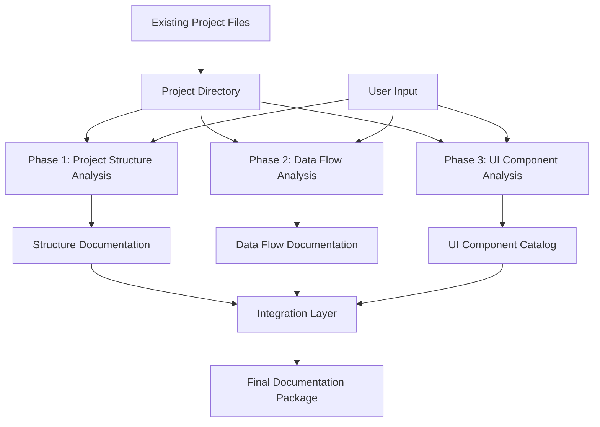

# Web Development Init Workflow - Data Flow & Transformations

## Overview
This document describes the data flow and transformations throughout the web-development init workflow, showing how raw project files are systematically analyzed and transformed into structured documentation.

## 1. High-Level Data Flow



## 2. Phase 1: Project Structure Analysis Data Flow

### Input Sources
```
Raw Project Files:
├── File System Hierarchy
├── package.json
├── tsconfig.json / jsconfig.json
├── webpack.config.js / vite.config.js
├── README.md
└── Directory Structure
```

### Transformation Pipeline

#### Step 1: Directory Scanning
```
Input: Project Root Path
↓ [File System Traversal]
Output: File Tree Structure
```

#### Step 2: Module Classification
```
File Tree Structure
↓ [Pattern Recognition Engine]
Module Type Classification:
- Components (React, Vue, Angular)
- Services (API, Business Logic)
- Utilities (Helpers, Utils)
- Configuration (Config files)
- Assets (Images, Styles)
```

#### Step 3: Dependency Analysis
```
Module Classification + Package Files
↓ [Dependency Graph Builder]
Dependency Mapping:
- Internal Dependencies
- External Package Dependencies  
- Circular Dependency Detection
- Dependency Hierarchy
```

#### Step 4: Methodology Detection
```
Directory Structure + Naming Patterns
↓ [Heuristic Analyzer]
Organization Methodology:
- Feature-based (by feature folders)
- Layer-based (by technical layers)
- Domain-driven (by business domains)
- Hybrid (mixed approaches)
```

### Output Schema
```typescript
interface ProjectStructureOutput {
  analysis: {
    rootPath: string;
    scanDate: Date;
    totalFiles: number;
    totalDirectories: number;
  };
  hierarchy: ModuleNode[];
  methodology: OrganizationMethodology;
  dependencies: DependencyGraph;
  compliance: BestPracticesReport;
  recommendations: string[];
}
```

## 3. Phase 2: Data Flow Analysis Data Flow

### Input Sources
```
Source Code Files:
├── API Configuration Files
├── Component Files (state usage)
├── Service Layer Files
├── Store/State Management Files
├── Network Request Files
├── Environment Variables
└── Configuration Files
```

### Transformation Pipeline

#### Step 1: API Pattern Detection
```
Source Code Files
↓ [AST Analysis + Regex Patterns]
API Pattern Identification:
- REST endpoints (axios, fetch)
- GraphQL queries/mutations
- WebSocket connections
- RPC calls
```

#### Step 2: State Management Analysis
```
Component & Store Files
↓ [Framework-Specific Analyzers]
State Pattern Detection:
- Redux/RTK patterns
- Zustand stores
- Context API usage
- Component local state
- External state libraries
```

#### Step 3: Data Transformation Mapping
```
API Patterns + State Patterns
↓ [Flow Tracer]
Data Flow Mapping:
- API → State transformations
- State → Component data flow
- Data validation layers
- Error handling patterns
```

#### Step 4: Integration Point Discovery
```
Configuration Files + Network Code
↓ [Integration Analyzer]
Integration Points:
- External API endpoints
- Third-party service integrations
- Database connections
- Authentication systems
```

### Output Schema
```typescript
interface DataFlowOutput {
  analysis: {
    scanDate: Date;
    frameworksDetected: string[];
    apiPatternsFound: number;
    stateManagementSystems: number;
  };
  apiPatterns: APIPatternInfo[];
  stateManagement: StateManagementInfo[];
  dataFlow: DataFlowDiagram;
  integrations: IntegrationPoint[];
  recommendations: DataFlowRecommendation[];
}
```

## 4. Phase 3: UI Component Analysis Data Flow

### Input Sources
```
UI Component Files:
├── React/Vue/Angular Components
├── Style Files (CSS, SCSS, styled-components)
├── Design System Files
├── Theme Configuration
├── Asset Files
└── Component Documentation
```

### Transformation Pipeline

#### Step 1: Component Discovery
```
Component Directories
↓ [Multi-Framework Scanner]
Component Inventory:
- Component file identification
- Framework-specific parsing
- Component type classification
- File association mapping
```

#### Step 2: Metadata Extraction
```
Component Files
↓ [AST Parser + Documentation Extractor]
Component Metadata:
- Props interface/types
- State variables
- Lifecycle methods
- Dependencies
- Documentation comments
```

#### Step 3: Design System Analysis
```
Style Files + Theme Files + Component Analysis
↓ [Design System Analyzer]
Design System Information:
- UI library identification (Material-UI, Ant Design)
- Custom design tokens
- Theme structure
- Style patterns
- Accessibility features
```

#### Step 4: Usage Pattern Analysis
```
Component Metadata + Import Analysis
↓ [Usage Pattern Detector]
Usage Patterns:
- Component composition patterns
- Prop drilling detection
- Reusability metrics
- Deprecation status
- Performance patterns
```

### Output Schema
```typescript
interface UIComponentOutput {
  analysis: {
    scanDate: Date;
    totalComponents: number;
    frameworksDetected: string[];
    designSystemsUsed: string[];
  };
  components: UIComponentInfo[];
  designSystem: DesignSystemInfo;
  folderStructure: FolderStructureInfo;
  patterns: UIPatternInfo[];
  themes: ThemeInfo[];
  recommendations: UIRecommendation[];
}
```

## 5. Integration Layer Data Flow

### Data Consolidation Process
```
Phase 1 Output + Phase 2 Output + Phase 3 Output
↓ [Data Merger & Cross-Reference Analyzer]
Consolidated Analysis:
- Cross-phase dependency validation
- Inconsistency detection
- Holistic recommendations
- Quality scoring
```

### Validation Pipeline
```
Consolidated Analysis
↓ [Multi-Layer Validator]
Validation Results:
- Structure-Data consistency check
- UI-Data integration validation
- Best practices compliance
- Security pattern verification
```

### Final Documentation Generation
```
Validated Analysis
↓ [Documentation Generator]
Final Output Package:
- project-structure.md
- data-flow-analysis.md  
- ui.json
- recommendations.md
- validation-report.md
```

## 6. Error Handling & Edge Cases

### Error Flow Management
```
Any Analysis Error
↓ [Error Handler]
Error Response:
- Graceful degradation
- Partial results where possible
- Clear error messaging
- Recovery suggestions
```

### Edge Case Handling
1. **Empty Projects**: Provide initialization templates
2. **Complex Monorepos**: Selective analysis with user guidance
3. **Non-Standard Structures**: Heuristic classification with manual override
4. **Performance Issues**: Streaming analysis with progress updates
5. **Access Restrictions**: Permission-aware scanning with alternative approaches

## 7. Data Transformation Quality Assurance

### Validation Rules
1. **Completeness**: All discovered items have complete metadata
2. **Consistency**: Cross-references between phases are valid
3. **Accuracy**: Pattern detection has >95% precision
4. **Timeliness**: Analysis completes within reasonable time bounds

### Quality Metrics
```typescript
interface QualityMetrics {
  completeness: number;    // 0-100
  accuracy: number;        // 0-100
  consistency: number;     // 0-100
  performance: {
    analysisTime: number;  // milliseconds
    memoryUsage: number;   // MB
    fileCount: number;
  };
}
```

## 8. Integration with Existing Systems

### MCP Server Integration Flow
```
Workflow Execution Request
↓ [MCP Server Handler]
Phase Execution
↓ [Smart Workflow Engine]
Step Validation
↓ [Context Manager]  
Data Transformation
↓ [Quality Validator]
Response Generation
```

### Context Management
- **Input Context**: User selections, project paths, configuration preferences
- **Phase Context**: Results from previous phases, validation states
- **Output Context**: Generated documentation, recommendations, next steps

---

This data flow design ensures systematic, reliable transformation of raw project data into comprehensive, actionable documentation while maintaining full integration with the agents-playbook ecosystem.
