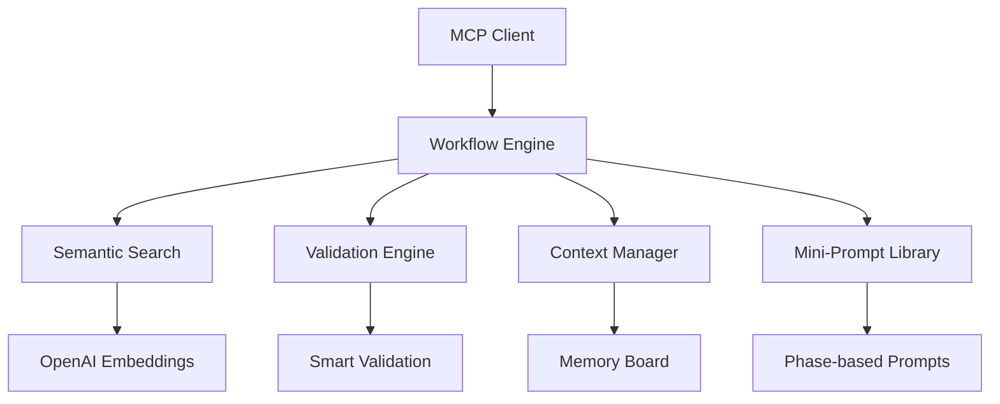

# 🎯 Agents Playbook: Structured Workflow Engine

[](https://opensource.org/licenses/MIT)
[](https://nodejs.org/)
[](https://www.typescriptlang.org/)
[]()

> **Enterprise-grade AI workflow orchestration platform** that transforms complex development processes into structured, repeatable agent workflows with intelligent routing, validation, and handoff mechanisms.

## 🎯 Overview

**Agents Playbook** is a context engineering framework designed to bring order to AI-driven development workflows. It provides battle-tested processes that work reliably across different AI model tiers through semantic workflow discovery and intelligent validation.

### Key Capabilities

- **🧠 Context Engineering** - Workflows engineered for reliable AI execution across model capabilities
- **🔧 9 Production Workflows** - Battle-tested processes with built-in guardrails and validation
- **⚡ Smart Validation** - Automatically validates prerequisites and skips irrelevant steps
- **🔄 Agent Handoffs** - Seamless context transfer between workflow phases with memory persistence
- **🔍 Critical Review** - Built-in quality assessment and continuous improvement phases
- **📋 25+ Mini-Prompts** - Context-engineered prompts organized by development phases
- **🔍 Semantic Search** - AI-powered workflow discovery using OpenAI embeddings
- **🛡️ Type Safety** - Full TypeScript implementation with comprehensive type definitions

### Architecture



## 📋 Prerequisites

Before you begin, ensure your development environment meets these requirements:

- **Node.js** 18.0.0 or higher
- **npm** 8.0.0 or higher
- **TypeScript** 5.0.0 or higher (automatically installed)
- **OpenAI API Key** (for semantic search functionality)

### System Requirements

- **Memory**: 2GB RAM minimum, 4GB recommended
- **Storage**: 500MB free space
- **Network**: Internet connection for OpenAI API calls

## 🚀 Quick Start

### 1. Installation

```bash
# Clone the repository
git clone https://github.com/your-repo/agents-playbook
cd agents-playbook

# Install dependencies
npm install

# Verify installation
npm run test
```

### 2. Environment Configuration

Create a `.env.local` file in the project root:

```env
# OpenAI Configuration (Required for semantic search)
OPENAI_API_KEY=your_openai_api_key_here

# Optional: Custom OpenAI settings
OPENAI_MODEL=text-embedding-3-small
OPENAI_MAX_TOKENS=8192

# Development settings
NODE_ENV=development
PORT=3000
```

### 3. Generate Search Index

```bash
# Build workflow embeddings for semantic search
npm run build:embeddings

# Verify embeddings were created
ls -la public/workflow-embeddings.json
```

### 4. Start Development Server

```bash
# Start the development server
npm run dev

# Server will be available at:
# - Web UI: http://localhost:3000
# - MCP Endpoint: http://localhost:3000/api/mcp
```

### 5. Verify Setup

```bash
# Test MCP server connection
DANGEROUSLY_OMIT_AUTH=true npx @modelcontextprotocol/inspector@latest http://localhost:3000/api/mcp

# Run comprehensive tests
npm run test:integration
```

## 🏗️ Project Structure

```
agents-playbook/
├── 📁 public/playbook/          # Core workflow definitions
│   ├── 📁 workflows/            # YAML workflow specifications
│   ├── 📁 mini-prompts/         # Context-engineered prompts
│   │   ├── analysis/            # Analysis phase prompts
│   │   ├── business/            # Business logic prompts
│   │   ├── development/         # Development phase prompts
│   │   ├── qa/                  # Quality assurance prompts
│   │   └── review/              # Review phase prompts
│   └── 📁 phases/               # Workflow phase definitions
├── 📁 src/
│   ├── 📁 lib/                  # Core engine implementation
│   │   ├── execution/           # Workflow execution engine
│   │   ├── loaders/             # Content loading utilities
│   │   ├── mcp-tools/           # MCP protocol tools
│   │   ├── types/               # TypeScript definitions
│   │   └── validation/          # Validation logic
│   └── 📁 app/                  # Next.js application
└── 📁 tests/                    # Comprehensive test suite
```

## 🧪 Testing & Quality Assurance

### Running Tests

```bash
# Run all tests
npm test

# Run integration tests only
npm run test:integration

# Run tests with coverage
npm run test:coverage

# Run tests in watch mode
npm run test:watch
```

### Test Categories

- **🔧 Unit Tests**: Core functionality validation
- **🔄 Integration Tests**: Workflow execution testing
- **📡 MCP Protocol Tests**: Server communication validation
- **🎯 Context System Tests**: Memory and handoff testing

### Quality Metrics

- **90+ Tests**: Comprehensive coverage across all modules
- **Type Safety**: Full TypeScript implementation
- **Lint Standards**: ESLint + Prettier configuration
- **Security**: Dependency vulnerability scanning

## 🛠️ API Reference

### Core MCP Tools

#### `get_available_workflows(task_description: string)`

Performs semantic search to find the most relevant workflows for a given task.

**Parameters:**
- `task_description` (string): Natural language description of the task

**Returns:**
```typescript
interface WorkflowMatch {
  id: string;
  title: string;
  description: string;
  similarity: number;  // 0-1 confidence score
  category: string;
  steps: number;
}
```

**Example:**
```typescript
// Input
task_description: "fix critical production bug"

// Output
{
  id: "quick-fix",
  title: "Quick Fix Workflow",
  similarity: 0.94,
  category: "Development",
  steps: 6
}
```

#### `select_workflow(workflow_id: string)`

Retrieves complete workflow specification with execution plan.

**Parameters:**
- `workflow_id` (string): Unique workflow identifier

**Returns:**
```typescript
interface WorkflowSpec {
  id: string;
  metadata: WorkflowMetadata;
  phases: Phase[];
  steps: Step[];
  validation: ValidationRule[];
}
```

#### `get_next_step(workflow_id: string, current_step: number, available_context?: string[])`

Provides step-by-step navigation with intelligent validation and context awareness.

**Parameters:**
- `workflow_id` (string): Current workflow identifier
- `current_step` (number): 0-based step index
- `available_context` (string[]): Available context keys

**Returns:**
```typescript
interface NextStepResponse {
  step: Step;
  should_skip: boolean;
  skip_reason?: string;
  required_context: string[];
  validation_results: ValidationResult[];
}
```

### Advanced Configuration

#### Environment Variables

```bash
# Core Configuration
OPENAI_API_KEY=                 # Required for semantic search
NODE_ENV=development            # Environment mode
PORT=3000                      # Server port

# OpenAI Settings
OPENAI_MODEL=text-embedding-3-small    # Embedding model
OPENAI_MAX_TOKENS=8192                 # Token limit
OPENAI_TIMEOUT=30000                   # Request timeout (ms)

# Performance Settings
CACHE_TTL=3600                 # Cache time-to-live (seconds)
MAX_SEARCH_RESULTS=10          # Maximum workflow matches
EMBEDDING_BATCH_SIZE=100       # Batch size for embeddings

# Security Settings
CORS_ORIGIN=*                  # CORS allowed origins
RATE_LIMIT_WINDOW=900000       # Rate limit window (ms)
RATE_LIMIT_MAX=100             # Max requests per window
```

#### Custom Workflow Configuration

Create `workflow.config.js` in your project root:

```javascript
module.exports = {
  // Custom workflow directories
  workflowPaths: [
    './custom-workflows',
    './team-workflows'
  ],
  
  // Validation rules
  validation: {
    strictMode: true,
    requirePhases: ['planning', 'review'],
    maxStepsPerPhase: 20
  },
  
  // Context management
  context: {
    persistenceMode: 'memory',  // 'memory' | 'file' | 'redis'
    maxContextSize: 10000,
    autoCleanup: true
  }
};
```

## 📁 Workflows (9 total)

### 🚀 Development (4)
- **feature-development** - Complete feature development lifecycle
- **product-development** - From idea to product launch
- **quick-fix** - Fast bug fixes and hotfixes
- **code-refactoring** - Code architecture improvements

### 🧪 Testing & QA (3)
- **fix-tests** - Systematic test failure diagnosis and repair with refactoring integration
- **fix-circular-dependencies** - Comprehensive circular dependency resolution with architectural refactoring
- **unit-test-coverage** - Comprehensive unit test coverage improvement

### 📋 Setup & Planning (2)
- **project-initialization** - New project setup with documentation review
- **trd-creation** - Technical Requirements Document creation with quality assessment

## 🎯 Usage Examples

```
1. Search: "create new feature"
2. Result: feature-development workflow (🎯 92% match)  
3. Execute: 14 steps with TRD integration and smart skipping
```

```
1. Search: "improve test coverage"  
2. Result: unit-test-coverage workflow (🎯 94% match)
3. Execute: 7 steps of systematic coverage improvement
```

```
1. Search: "circular dependencies"  
2. Result: fix-circular-dependencies workflow (🎯 95% match)
3. Execute: 7 steps of dependency resolution with refactoring integration
```

```
1. Search: "technical documentation"  
2. Result: trd-creation workflow (🎯 94% match)
3. Execute: 7 steps of TRD creation with validation
```

## 🔌 MCP Integration

### 🤖 Claude Desktop
```json
{
  "mcpServers": {
    "agents-playbook": {
      "url": "https://agents-playbook.vercel.app/api/mcp"
    }
  }
}
```

### 🎯 Cursor
Add to your Cursor settings or create a MCP configuration:

```json
{
  "mcpServers": {
    "agents-playbook": {
      "url": "https://agents-playbook.vercel.app/api/mcp",
      "description": "AI Agent Workflow Engine with semantic search"
    }
  }
}
```

**For Cursor users:**
1. Open Cursor Settings
2. Navigate to "Extensions" or "Integrations"
3. Add MCP Server configuration

### 📁 Direct File Usage (Any IDE)
Copy playbook files directly to your project:

```bash
# Copy entire playbook to your project
cp -r public/playbook/ /path/to/your/project/

# For Cursor: create a .cursorrules file
echo "Use workflows from playbook/ directory for structured development" > .cursorrules
```


## 📚 Local Usage

```bash
# Copy entire playbook to your project
cp -r public/playbook/ /path/to/your/project/

# For Cursor: create a .cursorrules file
echo "Use workflows from playbook/ directory for structured development" > .cursorrules
```

**Benefits:**
- ✅ Works without MCP server
- ✅ Customize for your team  
- ✅ Offline access
- ✅ Version control with project
- ✅ Cursor can reference workflows directly

## 🧠 How it works

- **Context Engineering** - workflows designed with clear context boundaries and validation
- **Semantic Search** - OpenAI embeddings understand task context for workflow selection
- **YAML Workflows** - structured processes with phases, steps, and guardrails
- **Mini-Prompts** - context-engineered reusable prompts that work across model tiers
- **Smart Validation** - prevents execution without required context, provides structure for low-tier models
- **Agent Handoffs** - memory board system for seamless context transfer between phases
- **Critical Review** - built-in quality assessment phases for continuous improvement

## 🚀 Deployment

### Vercel (Recommended)

```bash
# 1. Install Vercel CLI
npm i -g vercel

# 2. Deploy
vercel --prod

# 3. Set environment variables in Vercel dashboard
# OPENAI_API_KEY=your_key_here
```

### Docker

```dockerfile
# Dockerfile
FROM node:18-alpine
WORKDIR /app
COPY package*.json ./
RUN npm ci --only=production
COPY . .
RUN npm run build
EXPOSE 3000
CMD ["npm", "start"]
```

```bash
# Build and run
docker build -t agents-playbook .
docker run -p 3000:3000 -e OPENAI_API_KEY=your_key agents-playbook
```

### Self-Hosted

```bash
# Production build
npm run build
npm start

# PM2 process manager
npm install -g pm2
pm2 start ecosystem.config.js
```

## 🤝 Contributing

### Development Setup

```bash
# Fork and clone the repository
git clone https://github.com/YOUR_USERNAME/agents-playbook
cd agents-playbook

# Install dependencies
npm install

# Set up pre-commit hooks
npm run prepare

# Start development
npm run dev
```

### Code Standards

- **TypeScript**: All new code must be written in TypeScript
- **Testing**: Maintain >90% test coverage
- **Linting**: Code must pass ESLint and Prettier checks
- **Documentation**: Update docs for API changes

### Workflow Contribution

1. **Create Workflow**: Add YAML files to `public/playbook/workflows/`
2. **Add Mini-Prompts**: Create prompts in `public/playbook/mini-prompts/`
3. **Test Thoroughly**: Run integration tests
4. **Update Documentation**: Add usage examples

### Pull Request Process

1. Create feature branch: `git checkout -b feature/new-workflow`
2. Make changes with tests
3. Run quality checks: `npm run lint && npm test`
4. Create detailed PR with examples
5. Address review feedback

## 🐛 Troubleshooting

### Common Issues

#### "No workflows found"
```bash
# Verify embeddings exist
ls -la public/workflow-embeddings.json

# Rebuild embeddings
npm run build:embeddings

# Check for API key
echo $OPENAI_API_KEY
```

#### "OpenAI API errors"
```bash
# Verify API key format
curl -H "Authorization: Bearer $OPENAI_API_KEY" \
  https://api.openai.com/v1/models

# System falls back to text search if OpenAI unavailable
```

#### "MCP server connection failed"
```bash
# Check server status
curl http://localhost:3000/api/mcp

# Verify port availability
lsof -i :3000

# Check logs
npm run dev 2>&1 | grep ERROR
```

#### "Steps being skipped unexpectedly"
```bash
# Enable debug logging
DEBUG=workflow:* npm run dev

# Check context requirements
# Steps skip when required context is missing (expected behavior)
```

### Performance Issues

#### Slow semantic search
- Increase `EMBEDDING_BATCH_SIZE` in environment
- Consider upgrading OpenAI plan for higher rate limits
- Enable caching with `CACHE_TTL=3600`

#### High memory usage
- Reduce `MAX_SEARCH_RESULTS` to 5-10
- Enable `autoCleanup` in workflow config
- Monitor with `npm run monitor`

### Getting Help

- **Issues**: [GitHub Issues](https://github.com/your-repo/agents-playbook/issues)
- **Discussions**: [GitHub Discussions](https://github.com/your-repo/agents-playbook/discussions)
- **Documentation**: [Wiki](https://github.com/your-repo/agents-playbook/wiki)

## 📄 License

MIT License - see [LICENSE](LICENSE) file for details.

## 🙏 Acknowledgments

- **OpenAI** - Semantic search capabilities
- **Model Context Protocol** - MCP framework
- **Vercel** - Hosting and deployment
- **Community Contributors** - Workflow improvements

---

**🎯 Agents Playbook** - Enterprise-grade workflow orchestration for AI-driven development teams

[]()