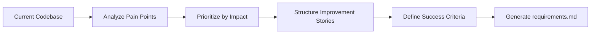

# Create Structured Refactoring Requirements Document (v1)

## 🎯 Goal
Create comprehensive structured refactoring requirements document with Technical Improvement Stories and Success Criteria in WHEN/THEN/SHALL format for clear refactoring implementation guidance.

## 📋 General Instructions
- **Follow instructions precisely** - analyze exactly what needs refactoring, no more, no less
- **Be systematic** - identify root causes, not just symptoms
- **Focus on impact** - prioritize changes by business and developer value

## 📥 Context (ask if missing)
1. **Existing Codebase** – current code structure, patterns, and architecture
2. **Performance Issues** – documented bottlenecks, slow queries, resource usage problems
3. **Maintenance Pain Points** – areas causing developer friction and frequent bugs
4. **Technical Debt** – accumulated shortcuts, outdated patterns, deprecated dependencies
5. **Business Context** – why refactoring is needed and expected outcomes

## ❓ Clarifying Questions (ask before proceeding)
**IMPORTANT: Ask clarifying questions directly in chat before proceeding with refactoring requirements creation.**

Generate a concise, prioritized set of one-line clarifying questions tailored to the provided context to fully understand: current pain points and their frequency, performance bottlenecks and their business impact, most problematic code areas and developer complaints, testing coverage and deployment risks, success metrics and improvement measurement, risk tolerance and rollback plans, and dependencies between different refactoring areas.


## 🔍 Refactoring Requirements Structure Format
Create refactoring requirements using this exact structure:

### Technical Improvement Story Format
**Improvement Story:** As a [developer/user], I need [technical improvement], so that [benefit/outcome].

### Success Criteria Format
#### Success Criteria
1. WHEN [condition] THEN system SHALL [measurable improvement]
2. WHEN [condition] THEN developers SHALL [productivity improvement]
3. WHEN [condition] THEN codebase SHALL [quality improvement]

## 📋 Refactoring Analysis Process
1. **Categorize Technical Debt** into logical improvement areas
2. **Identify Stakeholder Impact** for developers, users, and business
3. **Define Measurable Outcomes** for each refactoring area
4. **Use consistent SHALL language** for system improvements
5. **Cover quality, performance, and maintainability improvements**
6. **Prioritize by impact and feasibility**

## 📤 Output
**File:** `.agents-playbook/[feature-name]/requirements.md`

### Document Structure:
```markdown
# Refactoring Requirements Document

## Introduction
[Brief description of refactoring motivation and expected outcomes]

## Current State Analysis
### Pain Points Identified
1. **Performance Issues**: [Specific bottlenecks and impact]
2. **Code Quality Issues**: [Technical debt and maintainability problems]
3. **Developer Experience Issues**: [Productivity and workflow problems]
4. **Architecture Issues**: [Structural and design problems]

## Refactoring Requirements

### Requirement 1: [Performance Improvements]
**Improvement Story:** As a [user/developer], I need [performance improvement], so that [benefit].

#### Success Criteria
1. WHEN [load condition] THEN system SHALL [performance target]
2. WHEN [usage scenario] THEN response time SHALL [time requirement]
3. WHEN [measurement period] THEN resource usage SHALL [efficiency target]

### Requirement 2: [Code Quality Improvements]
**Improvement Story:** As a [developer], I need [code quality improvement], so that [maintainability benefit].

#### Success Criteria
1. WHEN [code analysis] THEN codebase SHALL [quality metric]
2. WHEN [development task] THEN developers SHALL [productivity improvement]
3. WHEN [code review] THEN code SHALL [standard compliance]

### Requirement 3: [Architecture Improvements]
**Improvement Story:** As a [system], I need [architectural improvement], so that [scalability/maintainability benefit].

#### Success Criteria
1. WHEN [system growth] THEN architecture SHALL [scalability requirement]
2. WHEN [component change] THEN system SHALL [isolation requirement]
3. WHEN [integration point] THEN interfaces SHALL [compatibility requirement]
```

## ✅ Quality Checklist
- [ ] **Complete Problem Analysis** – all major pain points identified and categorized
- [ ] **Clear Improvement Stories** – each requirement has structured improvement story
- [ ] **Measurable Success Criteria** – all criteria use WHEN/THEN/SHALL format
- [ ] **Stakeholder-Focused** – improvements written from stakeholder perspective
- [ ] **Prioritized Impact** – requirements ordered by business and technical value
- [ ] **Testable Improvements** – each success criterion can be measured and validated
- [ ] **Consistent Language** – unified terminology throughout document

## 🎯 Focus Areas
- **Performance Optimization** – measurable speed, resource, and efficiency improvements
- **Code Quality** – maintainability, readability, and technical debt reduction
- **Developer Experience** – productivity improvements and workflow optimization
- **Architecture** – scalability, modularity, and structural improvements
- **Testing Coverage** – automated testing and quality assurance improvements
- **Documentation** – knowledge transfer and onboarding improvements

## 📊 Refactoring Categories

### **Performance Refactoring**
- Database query optimization
- Caching implementation
- Resource usage optimization
- Algorithm improvements

### **Code Quality Refactoring**
- Code duplication elimination
- Design pattern implementation
- Naming and structure improvements
- Technical debt reduction

### **Architecture Refactoring**
- Component decoupling
- Interface simplification
- Dependency management
- Modularization improvements

### **Developer Experience Refactoring**
- Build process optimization
- Testing infrastructure improvements
- Development workflow enhancements
- Documentation and tooling improvements

## 🔄 Integration Notes
This prompt works with:
- **Existing codebase analysis** - identifies current state and problems
- **Performance monitoring data** - provides measurable baseline and targets
- **Code quality metrics** - incorporates maintainability and technical debt indicators
- **design.md** - aligns with architectural improvement plans
- **Leads to implementation planning** - provides structured requirements for refactoring tasks

## ➡️ Response Flow


## 💡 Best Practices
- **Start with user impact** – prioritize refactoring that improves user experience
- **Measure current state** – establish baseline metrics before setting improvement targets
- **Think incrementally** – plan refactoring in manageable phases
- **Consider risk** – balance improvement benefits against refactoring risks
- **Focus on code signals** – analyze code metrics and automated quality indicators
- **Plan for validation** – ensure improvements can be measured and verified
