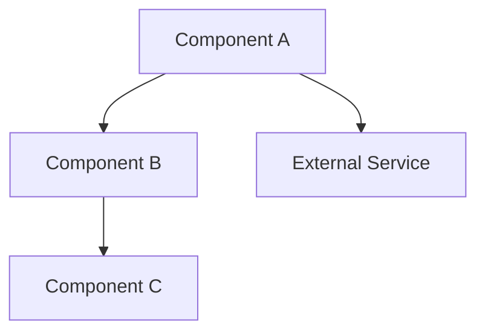
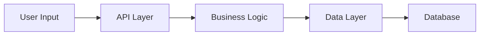
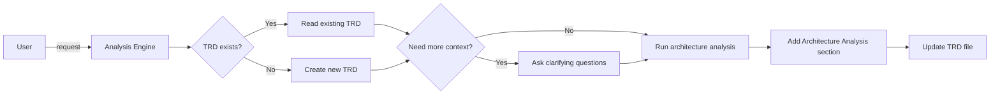

# Architecture Analysis Prompt 

## 🎯 Goal
Describe the current architecture, highlight weak spots, propose improvements, and add analysis to the TRD document—no fluff.

## 📥 Context (ask if missing)
1. **Scope** – which services/modules to inspect.
2. **Codebase** – repo paths or file access.
3. **Docs** – diagrams, ADRs, design notes.
4. **Focus** – pick the priority: scalability / performance / security / maintainability.
5. **Feature Name** – for TRD filename (e.g., "user-authentication", "payment-processing")
6. **Existing TRD** – check if `docs/planning/[feature-name]-trd.md` exists

## 🚦 Skip the analysis if
- The system is trivial **and** unchanged.
- A fresh report exists (< 30 days old).
- Only an urgent bug-fix is needed, with no architecture impact.

## 🔍 Analysis Checklist
- [ ] Components + responsibilities  
- [ ] Data flows & dependencies  
- [ ] Architectural patterns  
- [ ] Data stores, consistency, access patterns  
- [ ] Quality attributes: ⬆️ scalability, ⚡ performance, 🔒 security, 🛠️ maintainability  

## 📤 Output
1. Run architecture analysis on the codebase
2. **Add/Update in TRD:** `docs/planning/[feature-name]-trd.md`

### TRD Section Structure
Add the following section to the TRD document:

```markdown
## 5. Architecture Analysis

### 5.1 System Overview
**Architecture Style:** [Monolith/Microservices/Serverless/Hybrid]
**Primary Patterns:** [MVC, Event-driven, CQRS, etc.]

### 5.2 Component Architecture


**Component Responsibilities:**
- **Component A:** [Responsibility and files]
- **Component B:** [Responsibility and files]
- **Component C:** [Responsibility and files]

### 5.3 Data Architecture
**Data Stores:**
- **Primary Database:** [Type, purpose, access patterns]
- **Cache Layer:** [Type, purpose, data cached]
- **External Data:** [APIs, third-party sources]

**Data Flow:**


**Consistency Model:** [ACID/Eventual consistency/etc.]

### 5.4 Integration Architecture
**External Dependencies:**
- [Service 1: Purpose, SLA, failure handling]
- [Service 2: Purpose, SLA, failure handling]

**API Design:**
- **Style:** [REST/GraphQL/gRPC]
- **Authentication:** [Method used]
- **Rate Limiting:** [Current implementation]

### 5.5 Quality Attributes Assessment

#### 🔒 Security
**Strengths:**
- [Security strength 1]
- [Security strength 2]

**Weaknesses:**
- [Security gap 1: Impact and recommendation]
- [Security gap 2: Impact and recommendation]

#### ⚡ Performance
**Current Performance:**
- **Response Times:** [Measurements]
- **Throughput:** [Requests/sec capacity]
- **Bottlenecks:** [Identified performance issues]

**Optimization Opportunities:**
- [Performance improvement 1: Impact estimate]
- [Performance improvement 2: Impact estimate]

#### ⬆️ Scalability
**Current Capacity:**
- **Horizontal Scaling:** [Current capabilities]
- **Vertical Scaling:** [Current limits]
- **Auto-scaling:** [Implementation status]

**Scalability Constraints:**
- [Constraint 1: Description and impact]
- [Constraint 2: Description and impact]

#### 🛠️ Maintainability
**Code Organization:**
- **Modularity:** [Assessment of separation of concerns]
- **Coupling:** [Tight/loose coupling assessment]
- **Cohesion:** [Component cohesion evaluation]

**Technical Debt:**
- [Debt item 1: Impact on maintenance]
- [Debt item 2: Impact on maintenance]

### 5.6 Architecture Improvements

**High Priority:**
- [Improvement 1: Description, impact, effort]
- [Improvement 2: Description, impact, effort]

**Medium Priority:**
- [Improvement 3: Description, impact, effort]

**Future Considerations:**
- [Long-term architectural evolution]
- [Technology upgrade path]

### 5.7 Architecture Decision Records (ADRs)
**Key Decisions:**
- **Decision 1:** [What was decided and why]
- **Decision 2:** [What was decided and why]

**Trade-offs Made:**
- [Trade-off 1: What was sacrificed for what benefit]
- [Trade-off 2: What was sacrificed for what benefit]
```

**Note:** Include architecture diagrams using Mermaid. Reference specific components, services, and integration points with file paths where applicable.

## ➡️ Response Flow

