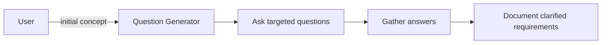

# Ask Clarifying Questions Prompt (v1)

## 🎯 Goal
Gather essential information through targeted clarifying questions to understand project scope, requirements, and constraints for MVP or product development.

## 📥 Context (ask if missing)
1. **Initial Concept** – basic product idea or description
2. **Target Audience** – who will use this product
3. **Technical Constraints** – platform requirements, existing systems
4. **Business Goals** – success metrics and objectives

## 🚦 Skip if
- Requirements are already well-defined and comprehensive

## 🔍 Clarifying Questions Process

### **Essential Questions**
Ask targeted questions to understand:

**Product Scope:**
- What is the core functionality that must be included?
- What features are nice-to-have vs essential?
- Are there any existing systems this needs to integrate with?

**Technical Requirements:**
- What platform should this target? (Web, mobile, desktop, API)
- Are there specific technology preferences or constraints?
- What's the expected scale/performance requirements?

**User Experience:**
- Who is the primary user of this product?
- What's the main user workflow or journey?
- Are there accessibility requirements?

**Business Context:**
- What's the timeline and priority level?
- Are there compliance or security requirements?
- What defines success for this project?

## 📤 Output
Document clarified requirements and key decisions made during the questioning process.

**File:** `.agents-playbook/[project-name]/clarified-requirements.md`

### Structure:
```markdown
# Clarified Requirements

## Project Overview
[Summary of the product/project]

## Scope Decisions
- **In Scope:** [Essential features confirmed]
- **Out of Scope:** [Features explicitly excluded]
- **Future Considerations:** [Nice-to-have features for later]

## Technical Decisions
- **Platform:** [Web/mobile/desktop/API]
- **Key Technologies:** [Framework preferences]
- **Integration Requirements:** [External systems]

## User Requirements
- **Primary Users:** [User personas]
- **Key Workflows:** [Main user journeys]
- **Success Metrics:** [How to measure success]

## Constraints & Assumptions
- **Timeline:** [Project timeline]
- **Resources:** [Available team/skills]
- **Dependencies:** [External dependencies]
```

## ➡️ Response Flow


## 💡 Question Guidelines
- Ask specific, actionable questions
- Focus on decisions that impact development approach
- Prioritize questions that help scope the MVP
- Avoid overwhelming with too many questions at once
