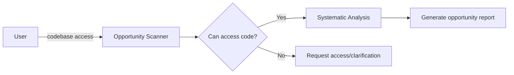

# Codebase Opportunity Analysis Prompt

## 🎯 Goal
Deep-scan the codebase to identify enhancement opportunities, gaps, and potential feature areas—no fluff.

## 📥 Context (ask if missing)
1. **Codebase Access** – git URL, main directories, or file paths
2. **Technology Stack** – languages, frameworks, libraries in use
3. **Current Features** – what the application currently does
4. **Known Pain Points** – existing issues, performance bottlenecks, user complaints

## 🚦 Skip if
- Codebase is inaccessible **or** recent comprehensive analysis exists (<30 days).

## 🔍 Checklist
- **Architecture Opportunities**  
  - [ ] Missing patterns or architectural improvements
  - [ ] Scalability bottlenecks and enhancement areas
  - [ ] Integration opportunities with external services
  - [ ] Security enhancement opportunities

- **Feature Gaps**  
  - [ ] Incomplete user flows or missing functionality
  - [ ] Areas lacking proper error handling
  - [ ] Missing accessibility features
  - [ ] Opportunities for automation

- **Technical Enhancements**  
  - [ ] Performance optimization opportunities
  - [ ] Code quality and maintainability improvements
  - [ ] Testing coverage gaps
  - [ ] Documentation opportunities

- **User Experience**  
  - [ ] UI/UX improvement areas
  - [ ] Missing user feedback mechanisms
  - [ ] Onboarding and help system gaps
  - [ ] Mobile/responsive enhancement opportunities

## 🔧 Analysis Methods
Use these systematic approaches:
- **Code Scanning**: Look for TODO comments, deprecated functions, empty catch blocks
- **Architecture Review**: Identify missing design patterns, coupling issues
- **Dependency Analysis**: Check for outdated libraries, security vulnerabilities
- **Feature Mapping**: Map existing features against common industry standards

## 📤 Outputs (in `.agents-playbook/[project-name]/codebase-opportunity-analysis.md`):
1. **Executive Summary** – high-level findings and opportunity count
2. **Architecture Opportunities** – scalability, patterns, integrations
3. **Feature Enhancement Areas** – missing functionality, incomplete flows
4. **Technical Debt Opportunities** – performance, security, maintainability
5. **User Experience Gaps** – UI/UX, accessibility, usability improvements
6. **Quick Wins vs Long-term Projects** – categorized by implementation effort
7. **Priority Matrix** – impact vs effort analysis

## ➡️ Response Flow
