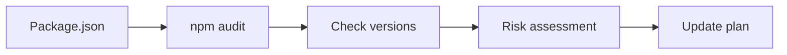

# Dependency Audit Prompt

## 🎯 Goal
Quick analysis of dependencies to identify security issues and safe updates.

## 📥 Context (ask if missing)
1. **Package.json** – current dependency list with versions
2. **Known Issues** – any reported problems or conflicts

## 🚦 Skip if
- Dependencies checked recently (<7 days) **or** no package.json exists.

## 🔍 Checklist
- [ ] Run `npm audit` for security vulnerabilities
- [ ] Check for outdated packages with `npm outdated`
- [ ] Identify major vs minor vs patch updates
- [ ] Flag any breaking changes in changelogs
- [ ] Note critical security fixes that need priority

## 📤 Output
1. List security vulnerabilities (if any)
2. Group updates by risk: **Low** (patch), **Medium** (minor), **High** (major)
3. Recommend update approach: individual vs batch
4. Note any breaking changes to watch for

## ➡️ Response Flow
