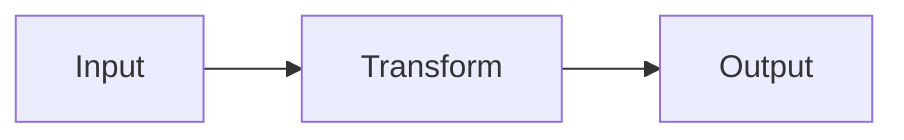
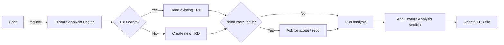

# Feature Analysis Prompt (v2)

## 🎯 Goal
Dissect an existing feature, reveal weak spots, suggest upgrades, and add analysis to the TRD document—no fluff.

## 📥 Context (ask if missing)
1. **Feature** – name or scope boundaries.
2. **Repo Access** – code paths / git URL.
3. **Focus** – choose: performance / architecture / UX / tech-debt.
4. **Known Pains** – bugs, slow paths, UX complaints.
5. **Feature Name** – for TRD filename (e.g., "user-authentication", "payment-processing")
6. **Existing TRD** – check if `docs/planning/[feature-name]-trd.md` exists

## 🚦 Skip if
- Feature is trivial **and** unchanged, or you already have a fresh analysis (<30 days).

## 🔍 Checklist
- **Function**  
  - [ ] Core use cases & user flows  
  - [ ] Business rules & validation  
  - [ ] Data inputs → transforms → outputs  
  - [ ] Integration touchpoints  

- **Tech**  
  - [ ] Component structure & patterns  
  - [ ] Code quality & organization  
  - [ ] Performance hotspots (CPU, I/O, DB)  
  - [ ] Security: authN/Z, data protection  
  - [ ] Error / edge-case handling  

- **UX**  
  - [ ] Usability & interface sanity  
  - [ ] Accessibility flags (WCAG, etc.)  
  - [ ] Perceived speed / responsiveness  
  - [ ] Clarity of error messages  

## 📤 Output
1. Run analysis and gather insights from the codebase
2. **Add/Update in TRD:** `docs/planning/[feature-name]-trd.md`

### TRD Section Structure
Add the following section to the TRD document:

```markdown
## 4. Feature Analysis

### 4.1 Current Feature Overview
**Feature Scope:** [What the feature currently does]
**Core Use Cases:**
- [Use case 1: User flow description]
- [Use case 2: User flow description]

### 4.2 Functional Analysis
**Business Rules & Validation:**
- [Rule 1: Description]
- [Rule 2: Description]

**Data Flow:**


**Integration Points:**
- [External system 1: Purpose]
- [External system 2: Purpose]

### 4.3 Technical Analysis
**Component Structure:**
- [Component 1: Responsibility & files]
- [Component 2: Responsibility & files]

**Code Quality Assessment:**
- **Strengths:** [What's working well]
- **Weaknesses:** [Areas needing improvement]
- **Organization:** [Code structure evaluation]

**Performance Analysis:**
- **Hotspots:** [CPU/IO/DB bottlenecks with line references]
- **Response Times:** [Current measurements]
- **Resource Usage:** [Memory/CPU patterns]

**Security Assessment:**
- **Authentication:** [Current auth mechanism]
- **Authorization:** [Access control implementation]
- **Data Protection:** [How sensitive data is handled]
- **Vulnerabilities:** [Identified security gaps]

### 4.4 UX Analysis
**Usability:**
- **User Interface:** [Current UI assessment]
- **User Experience:** [Flow efficiency]
- **Error Handling:** [How errors are presented]

**Accessibility:**
- **WCAG Compliance:** [Current state]
- **Accessibility Gaps:** [Areas needing improvement]

**Performance Perception:**
- **Loading Times:** [User-perceived performance]
- **Responsiveness:** [Interaction feedback]

### 4.5 Improvement Recommendations
**Priority 1 (Critical):**
- [Improvement 1: Description, effort estimate, file refs]

**Priority 2 (High):**
- [Improvement 2: Description, effort estimate, file refs]

**Priority 3 (Medium):**
- [Improvement 3: Description, effort estimate, file refs]

**Quick Wins:**
- [Quick win 1: Low effort, high impact]
- [Quick win 2: Low effort, high impact]
```

**Note:** Include component diagrams and data flow using Mermaid. Reference specific files and line numbers for technical findings.

## ➡️ Response Flow

