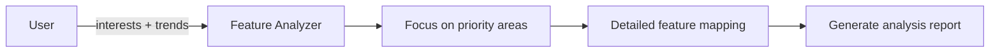

# Specific Feature Analysis Prompt

## 🎯 Goal
Deep-dive into specific feature categories based on user interests and trend research to identify concrete enhancement opportunities.

## 📥 Context (ask if missing)
1. **User Interest Areas** – priority categories identified
2. **Trend Research Results** – current market trends and technologies
3. **Codebase Analysis** – existing architecture and capabilities
4. **Technology Constraints** – current stack limitations or preferences

## 🚦 Skip if
- Interests are too broad for specific analysis **or** comprehensive feature analysis was completed recently (<14 days).

## 🔍 Analysis Framework
Focus on specific feature categories:

### 🎯 **Targeted Feature Analysis**
Based on user interests, analyze:

**If User Experience Focus:**
- [ ] Progressive Web App capabilities
- [ ] Responsive design improvements
- [ ] Accessibility compliance (WCAG)
- [ ] Performance optimization opportunities
- [ ] Mobile-first enhancements

**If Technical Capabilities:**
- [ ] API development and documentation
- [ ] Database optimization and scaling
- [ ] Caching strategies and CDN integration
- [ ] Microservices architecture opportunities
- [ ] CI/CD pipeline improvements

**If Business Impact:**
- [ ] Analytics and reporting features
- [ ] User onboarding and engagement
- [ ] Monetization feature opportunities
- [ ] Multi-tenant or white-label capabilities
- [ ] Integration marketplace opportunities

**If Innovation Focus:**
- [ ] AI/ML integration points
- [ ] Real-time features (WebSocket, SSE)
- [ ] Advanced search and filtering
- [ ] Workflow automation capabilities
- [ ] Data visualization and dashboards

## 🔧 Analysis Methods
Systematic feature exploration:

1. **Feature Mapping**
   - Map current features against industry standards
   - Identify feature gaps in user journeys
   - Analyze feature interdependencies

2. **Implementation Assessment**
   - Evaluate technical feasibility
   - Estimate implementation complexity
   - Identify required dependencies

3. **Value Analysis**
   - Assess potential user impact
   - Estimate business value
   - Consider maintenance overhead

## 📤 Outputs (in `.agents-playbook/[project-name]/specific-feature-analysis.md`):
1. **Priority Feature Categories** – ranked by user interest and feasibility
2. **Detailed Feature Specifications** – concrete feature descriptions
3. **Implementation Roadmap** – suggested development sequence
4. **Technical Requirements** – dependencies and architecture needs
5. **Effort Estimates** – rough sizing for each feature category
6. **Risk Assessment** – potential challenges and mitigation strategies
7. **Success Metrics** – how to measure feature impact

## ➡️ Response Flow
