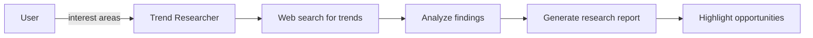

# Technology Trend Research Prompt

## 🎯 Goal
Research current technology trends, best practices, and emerging patterns relevant to the user's areas of interest.

## 📥 Context (ask if missing)
1. **User Interest Areas** – priority categories from interest discovery
2. **Technology Stack** – current technologies in use
3. **Industry Context** – business domain, target market
4. **Competitive Landscape** – known competitors or industry leaders

## 🚦 Skip if
- User interests are too vague **or** recent comprehensive market research exists (<30 days).

## 🔍 Research Areas
Focus research based on user priorities:

### 🌐 **Web Search Targets**
- **Industry Reports**: "2024 [technology] trends", "best practices [domain]"
- **Technology Evolution**: "[framework] roadmap", "emerging [category] tools"
- **Case Studies**: "[technology] implementation examples", "success stories"
- **Performance Benchmarks**: "[technology] performance comparison"

### 📊 **Research Categories**
- **Emerging Technologies**
  - [ ] New frameworks and libraries in the stack
  - [ ] AI/ML integration opportunities  
  - [ ] Performance optimization tools
  - [ ] Security enhancement solutions

- **Industry Best Practices**
  - [ ] UX/UI design trends
  - [ ] Development methodologies
  - [ ] Testing and deployment strategies
  - [ ] Monitoring and observability

- **Market Developments**
  - [ ] User expectation changes
  - [ ] Competitive feature analysis
  - [ ] Regulatory compliance updates
  - [ ] Accessibility standards evolution

## 🔧 Research Methods
Systematic approach to gather current information:

1. **Web Search Strategy**
   - Use specific, recent queries (2023-2024)
   - Focus on authoritative sources (GitHub, tech blogs, documentation)
   - Look for adoption statistics and community feedback

2. **Technology Assessment**
   - Check library/framework release notes and roadmaps
   - Review GitHub trends and star counts
   - Analyze community discussions and issues

3. **Competitive Analysis**
   - Research similar applications and their features
   - Identify emerging patterns in the industry
   - Look for innovative approaches to common problems

## 📤 Outputs (in `.agents-playbook/[project-name]/trend-research.md`):
1. **Executive Summary** – key trends and opportunities
2. **Technology Trends** – relevant emerging tools and frameworks
3. **Industry Best Practices** – current standards and methodologies
4. **Competitive Insights** – what others are doing successfully
5. **Implementation Opportunities** – how trends apply to current project
6. **Risk Assessment** – potential challenges and considerations
7. **Recommended Focus Areas** – prioritized trends for deeper analysis

## ➡️ Response Flow
