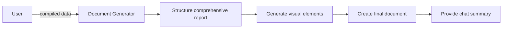

# Create Feature Suggestions Document Prompt

## 🎯 Goal
Generate a comprehensive, actionable feature suggestions document that summarizes all findings and provides clear next steps.

## 📥 Context (ask if missing)
1. **Compiled Feature Suggestions** – prioritized feature list
2. **User Interest Priorities** – focus areas identified
3. **Codebase Analysis** – technical opportunities discovered
4. **Code Patterns & Best Practices** – existing patterns, conventions, and reusable components identified
5. **Trend Research** – market insights gathered

## 🚦 Skip if
- No compiled suggestions exist **or** final document already created recently.

## 🔍 Document Structure
Create a comprehensive report with:

### 📋 **Executive Summary**
- Key findings and top recommendations
- High-impact opportunities identified
- Strategic alignment with user interests
- Recommended immediate next steps

### 🎯 **Priority Features**
For each top-priority feature:
- Clear description and user value proposition
- Implementation complexity estimate
- Technical requirements and dependencies
- Alignment with existing code patterns and conventions
- Reusable components and patterns that can be leveraged
- Expected business impact
- Timeline recommendation

### ⚡ **Quick Wins Section**
Features that can be implemented in 1-4 weeks:
- Specific implementation details following existing patterns
- Existing components and utilities that can be reused
- Required resources and skills
- Expected user impact
- Success metrics to track

### 🚀 **Innovation Opportunities**
Cutting-edge features that could differentiate:
- Market trend alignment
- Competitive advantage potential
- Technical feasibility assessment
- Long-term strategic value

### 🗺️ **Implementation Roadmap**
Recommended development sequence:
- Phase 1: Quick wins and foundations
- Phase 2: Core feature development  
- Phase 3: Advanced capabilities
- Phase 4: Innovation features

## 📊 **Visual Elements**
Include helpful diagrams:
- Feature priority matrix (Impact vs Effort)
- Implementation timeline
- Feature relationship map
- Technology trend alignment

## 📤 Final Output
Create comprehensive document: `.agents-playbook/[project-name]/feature-suggestions-report.md`

### Document Sections:
1. **Executive Summary** (1-2 pages)
2. **Methodology** – how analysis was conducted
3. **Codebase Opportunities** – technical enhancement areas
4. **Code Patterns Analysis** – existing patterns, conventions, and reusable components
5. **Market Research Insights** – relevant trends and best practices  
6. **Priority Feature Recommendations** – top 10-15 features detailed with pattern alignment
7. **Quick Wins** – immediate opportunities (1-4 weeks) leveraging existing patterns
8. **Short-term Roadmap** – next quarter priorities (1-3 months)
9. **Long-term Vision** – future opportunities (3-12 months)
10. **Implementation Guidelines** – technical approach recommendations following established patterns
11. **Success Metrics** – how to measure feature impact
12. **Resource Requirements** – estimated effort and skills needed
13. **Risk Assessment** – potential challenges and mitigation
14. **Appendices** – raw data, detailed analysis, additional research

### Chat Output Summary
Also provide a concise chat summary highlighting:
- Top 5 recommended features with 1-line descriptions
- 3 immediate quick wins to consider
- Key market trends that influenced recommendations
- Next steps for implementation planning

## ➡️ Response Flow
