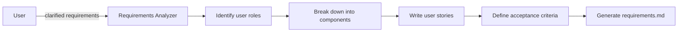

# Create Structured Requirements Document Prompt (v1)

## 🎯 Goal
Create comprehensive structured requirements document with User Stories and Acceptance Criteria in WHEN/THEN/SHALL format for clear implementation guidance.

## 📥 Context (ask if missing)
1. **Clarified Requirements** – business requirements with clarifications from gather-requirements
2. **Feature Description** – what functionality is being built
3. **User Personas** – who will use this feature
4. **Business Context** – why this feature is needed
5. **Existing Systems** – current system state and constraints

## 🚦 Skip if
- Structured requirements already exist (<30 days) or feature scope is trivial

## 🔍 Requirements Structure Format
Create requirements using this exact structure:

### User Story Format
**User Story:** Как [роль пользователя], я хочу [действие/функциональность], чтобы [цель/выгода].

### Acceptance Criteria Format
#### Acceptance Criteria
1. WHEN [условие] THEN система SHALL [действие/результат]
2. WHEN [условие] THEN система SHALL [действие/результат]
3. WHEN [условие] THEN система SHALL [действие/результат]

## 📋 Requirements Analysis Process
1. **Break down feature** into logical user-facing components
2. **Identify user roles** who will interact with each component
3. **Define clear behaviors** for each scenario
4. **Use consistent SHALL language** for system requirements
5. **Cover happy paths and edge cases**

## 📤 Output
**File:** `.agents-playbook/[feature-name]/requirements.md`

### Document Structure:
```markdown
# Requirements Document

## Introduction
[Краткое описание функции и её назначения]

## Requirements

### Requirement 1
**User Story:** Как [роль], я хочу [действие], чтобы [цель].

#### Acceptance Criteria
1. WHEN [условие] THEN система SHALL [действие]
2. WHEN [условие] THEN система SHALL [действие]

### Requirement 2
[Повторить структуру]
```

## ✅ Quality Checklist
- [ ] **Complete User Stories** – каждое требование имеет User Story
- [ ] **Clear Acceptance Criteria** – все критерии используют WHEN/THEN/SHALL
- [ ] **Testable Requirements** – каждый критерий можно протестировать
- [ ] **User-Focused** – требования написаны с точки зрения пользователя
- [ ] **Edge Cases** – покрыты граничные случаи и исключения
- [ ] **Consistent Language** – использована единообразная терминология

## 🎯 Focus Areas
- **User Experience** – как пользователь будет взаимодействовать с функцией
- **System Behavior** – что должна делать система в каждом сценарии
- **Authorization** – кто может выполнять какие действия
- **Data Handling** – как система обрабатывает и сохраняет данные
- **Error Scenarios** – что происходит при ошибках
- **Performance** – требования к быстродействию и отзывчивости

## ➡️ Response Flow


## 🔄 Integration Notes
This prompt works with:
- `gather-requirements.md` - provides initial requirements
- `create-trd.md` - uses structured requirements for technical design
- `implement-feature.md` - implements based on clear acceptance criteria
