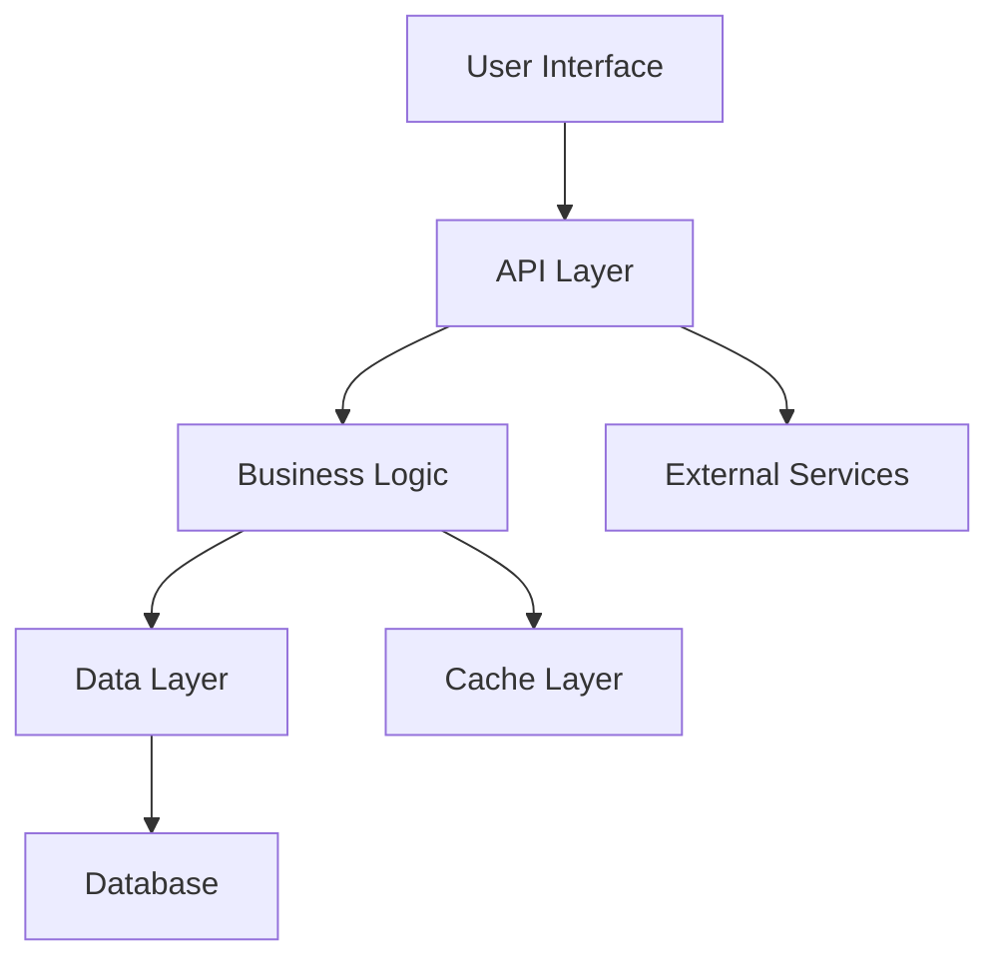
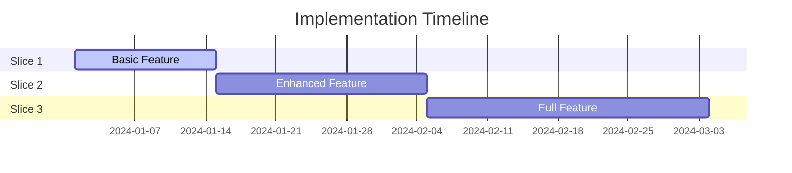
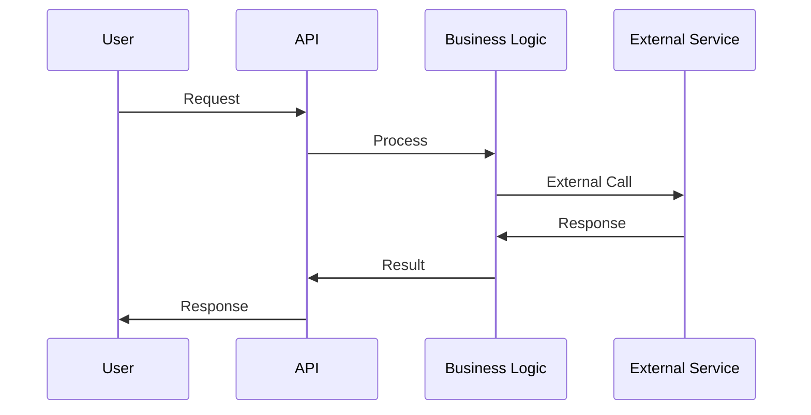
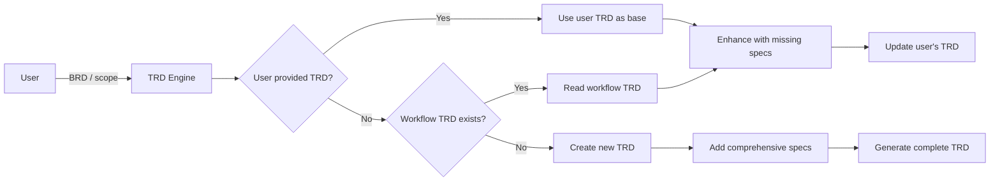

# Create Technical Requirements Document (TRD) Prompt 

## 🎯 Goal
Turn business needs into a tech-ready TRD, building on existing analysis sections and adding comprehensive technical specifications—no fluff.

## 📥 Context (ask if missing)
1. **Feature Name** – for TRD filename (e.g., "user-authentication", "payment-processing")
2. **Existing TRD** – check if `docs/planning/[feature-name]-trd.md` exists with analysis sections
3. **User-provided TRD** – if user has provided their own TRD document, use it as base
4. **Business Requirements** – link or paste if not already in TRD
5. **Tech Constraints** – platform, compliance, perf targets, etc.
6. **Stakeholders** – who signs off on the tech design?

## 🚦 Skip if
- A current TRD exists with complete technical specifications (<30 days) or scope is trivial/temporary.

## 🔍 TRD Base Check
**If user provided their own TRD:**
- [ ] **Use as foundation:** Take user's TRD as the primary base document
- [ ] **Preserve structure:** Keep user's existing sections and organization
- [ ] **Update/enhance:** Add missing technical specifications without removing existing content
- [ ] **Maintain style:** Follow user's document formatting and terminology

**If using workflow-generated TRD, verify existing sections:**
- [ ] **Section 2:** Requirements Analysis (from gather-requirements)
- [ ] **Section 3:** Clarified Requirements (from ask-clarifying-questions)  
- [ ] **Section 4:** Feature Analysis (from feature-analysis)
- [ ] **Section 5:** Architecture Analysis (from architecture-analysis)

## 🔍 Technical Specification Checklist
- **Solution Architecture**  
  - [ ] High-level design & component breakdown
  - [ ] Technology stack selection & rationale
  - [ ] Data models & validation rules

- **Implementation Strategy**
  - [ ] Break features into vertical slices (complete user scenarios)
  - [ ] Define delivery order from simplest to most complex slice
  - [ ] Ensure each slice delivers working end-to-end functionality

- **API & Integration Design**  
  - [ ] Endpoints, payloads, auth, rate limits  
  - [ ] External services, queues, webhooks, SSO  

  

- **Development Standards**  
  - [ ] Code style, testing, error handling patterns  

## 📤 Output
1. **If user provided TRD:** Use their document as base, enhance with missing technical specifications
2. **If workflow TRD exists:** Read existing file and preserve all previous sections  
3. **If no TRD:** Create new one with comprehensive technical specifications
4. **Update/Create TRD:** `docs/planning/[feature-name]-trd.md`

### TRD Section Structure to Add
Add the following sections to the existing TRD document (adapt numbering based on user's TRD structure):

```markdown
## 1. Executive Summary
**Project:** [Feature name and purpose]
**Objectives:** [Primary goals and success metrics]
**Timeline:** [Key milestones and delivery dates]
**Tech Stack:** [Primary technologies and frameworks]

## 6. Solution Architecture

### 6.1 High-Level Design


### 6.2 Component Design
**Core Components:**
- **Component A:** [Responsibility, interfaces, dependencies]
- **Component B:** [Responsibility, interfaces, dependencies]

**Technology Stack Rationale:**
- **Frontend:** [Choice and why]
- **Backend:** [Choice and why]  
- **Database:** [Choice and why]
- **Infrastructure:** [Choice and why]

### 6.3 Data Design
**Data Models:**
```typescript
interface UserModel {
  id: string;
  email: string;
  // ... other fields
}
```

**Database Schema:**
- **Tables/Collections:** [Structure and relationships]
- **Indexes:** [Performance optimization strategy]
- **Validation Rules:** [Data integrity constraints]

## 7. Implementation Strategy

### 7.1 Vertical Slice Breakdown
**Slice 1: [Name]** (Simplest - 1-2 weeks)
- [ ] [Feature component 1]
- [ ] [Feature component 2]
- **Value:** [End-to-end user value delivered]

**Slice 2: [Name]** (Medium - 2-3 weeks)  
- [ ] [Feature component 3]
- [ ] [Feature component 4]
- **Value:** [Additional user value]

**Slice 3: [Name]** (Complex - 3-4 weeks)
- [ ] [Advanced feature component]
- [ ] [Integration component]
- **Value:** [Full feature completion]

### 7.2 Delivery Timeline


## 8. API Specification

### 8.1 Endpoint Design
| Method | Endpoint | Purpose | Auth Required | Rate Limit |
|--------|----------|---------|---------------|------------|
| GET | `/api/feature` | [Purpose] | Yes | 100/min |
| POST | `/api/feature` | [Purpose] | Yes | 10/min |

### 8.2 Request/Response Examples
**POST /api/feature**
```json
{
  "request": {
    "field1": "value1",
    "field2": "value2"
  },
  "response": {
    "id": "123",
    "status": "success"
  }
}
```

### 8.3 Error Handling
| Error Code | Description | Response |
|------------|-------------|----------|
| 400 | Bad Request | `{"error": "Invalid input"}` |
| 401 | Unauthorized | `{"error": "Auth required"}` |

## 9. Integration Architecture

### 9.1 External Services
**Service 1: [Name]**
- **Purpose:** [What it provides]
- **Integration:** [How we connect]
- **Fallback:** [What happens if it fails]
- **SLA:** [Expected availability/performance]

### 9.2 Event Architecture


## 10. Development Standards

### 10.1 Code Quality
- **Style Guide:** [Link to coding standards]
- **Linting:** [ESLint/Prettier configuration]
- **Code Review:** [Process and checklist]

### 10.2 Testing Strategy
**Unit Tests:**
- **Coverage Target:** 80%+ for business logic
- **Framework:** [Jest/Vitest/etc.]

**Integration Tests:**
- **API Tests:** [Postman/Newman/etc.]
- **Database Tests:** [Test database strategy]

**E2E Tests:**
- **Framework:** [Playwright/Cypress/etc.]
- **Critical Paths:** [List of flows to test]

### 10.3 Error Handling Patterns
```typescript
// Standardized error response
interface ErrorResponse {
  error: string;
  code: string;
  details?: any;
  timestamp: string;
}
```

## 11. Security Considerations

### 11.1 Authentication & Authorization
- **Auth Method:** [JWT/OAuth/etc.]
- **Role-Based Access:** [RBAC implementation]
- **Session Management:** [How sessions work]

### 11.2 Data Protection
- **Encryption:** [At rest and in transit]
- **PII Handling:** [Personal data protection]
- **Audit Logging:** [What gets logged for security]

## 12. Risk Assessment

### 12.1 Technical Risks
| Risk | Probability | Impact | Mitigation |
|------|-------------|--------|------------|
| [Risk 1] | Medium | High | [Mitigation strategy] |

### 12.2 Dependency Risks
- **External Service Downtime:** [Impact and fallback]
- **Third-party API Changes:** [Monitoring and adaptation]

## 13. Appendices

### A. Architecture Decision Records (ADRs)
- **ADR-001:** [Technology choice rationale]
- **ADR-002:** [Architecture pattern decision]

### B. Glossary
- **Term 1:** Definition
- **Term 2:** Definition
```

**Note:** If user provided their own TRD, respect their structure and enhance it. For workflow-generated TRDs, this builds on existing analysis sections (2-5). Include comprehensive diagrams using Mermaid and reference specific implementation details.

## ➡️ Response Flow

