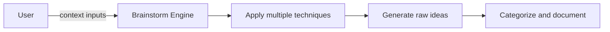

# Feature Brainstorming Prompt

## 🎯 Goal
Generate creative feature ideas using structured brainstorming techniques—innovative and practical.

## 📥 Context (ask if missing)
1. **Codebase Analysis** – opportunity areas and technical capabilities
2. **User Interests** – priority focus areas identified
3. **Trend Research** – current market trends and best practices
4. **Constraints** – technical, budget, or timeline limitations

## 🚦 Skip if
- All inputs are too vague **or** comprehensive feature list already exists.

## 🔍 Brainstorming Techniques
Apply multiple creative techniques for comprehensive ideation:

### 🌸 **Lotus Blossom Technique**
1. Place main challenge/opportunity in center
2. Generate 8 related themes around it
3. Expand each theme into 8 specific features
4. Result: 64+ concrete feature ideas

### 🎭 **Worst Possible Idea Method**
1. Generate deliberately bad feature ideas
2. Analyze why they're bad
3. Flip them into positive solutions
4. Often reveals unexpected opportunities

### 🔄 **SCAMPER Analysis**
Apply to existing features:
- **Substitute**: What could we replace?
- **Combine**: What features could merge?
- **Adapt**: What could we borrow from other domains?
- **Modify**: What could we enhance or scale?
- **Put to other uses**: How else could this be used?
- **Eliminate**: What could we remove to simplify?
- **Reverse**: What if we flipped the approach?

### 🧩 **Morphological Analysis**
1. Break down feature dimensions (UI, data, workflow, etc.)
2. List alternatives for each dimension
3. Combine different alternatives systematically
4. Discover unexpected feature combinations

## 🎨 **Creative Prompts**
Use these thinking triggers:

> **"What if..."**
> - What if we had unlimited budget?
> - What if we targeted different users?
> - What if we used cutting-edge tech?
> - What if we simplified everything?

> **"How might we..."**
> - How might we surprise users?
> - How might we automate routine tasks?
> - How might we connect disparate features?
> - How might we gamify the experience?

## 📤 Outputs (in `.agents-playbook/[project-name]/brainstormed-features.md`):
1. **Raw Feature Ideas** – unfiltered list from all techniques
2. **Categorized Features** – grouped by type/area
3. **Novel Concepts** – most creative and unexpected ideas
4. **Improvement Ideas** – enhancements to existing features
5. **Integration Opportunities** – cross-feature synergies
6. **Innovation Concepts** – cutting-edge possibilities
7. **Quick Wins** – simple but impactful additions

## ➡️ Response Flow
