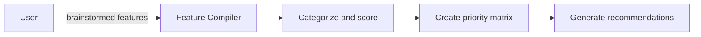

# Feature Compilation & Prioritization Prompt

## 🎯 Goal
Consolidate brainstormed features into a prioritized, actionable list with clear recommendations—strategic and practical.

## 📥 Context (ask if missing)
1. **Brainstormed Features** – raw ideas from ideation sessions
2. **Specific Feature Analysis** – detailed category analysis
3. **User Interest Priorities** – areas of highest user value
4. **Technical Constraints** – implementation limitations

## 🚦 Skip if
- No features have been brainstormed **or** prioritization already completed recently.

## 🔍 Compilation Process
Systematic approach to feature organization:

### 📊 **Feature Categorization**
Organize features by:
- **Impact Level**: High / Medium / Low user value
- **Effort Level**: Small / Medium / Large implementation
- **Type**: New feature / Enhancement / Integration / Technical improvement
- **Timeline**: Quick win / Short-term / Long-term

### 🎯 **Prioritization Matrix**
Use Impact vs Effort quadrants:
- **High Impact, Low Effort**: Priority quick wins
- **High Impact, High Effort**: Major initiatives
- **Low Impact, Low Effort**: Nice-to-haves
- **Low Impact, High Effort**: Avoid or deprioritize

### 🔗 **Dependency Analysis**
Map feature relationships:
- Which features build on others?
- What foundational work enables multiple features?
- What are the logical implementation sequences?

### 💡 **Innovation Assessment**
Evaluate creative potential:
- Which ideas are most unique/differentiating?
- What features could create competitive advantages?
- Which align best with current market trends?

## 🏆 **Evaluation Criteria**
Score each feature (1-5) on:
- **User Value**: Solves real problems, improves experience
- **Business Impact**: Revenue, retention, growth potential
- **Technical Feasibility**: Fits current architecture, reasonable complexity
- **Strategic Alignment**: Matches company/product direction
- **Market Timing**: Relevance to current trends and needs

## 📤 Outputs (in `.agents-playbook/[project-name]/compiled-feature-suggestions.md`):
1. **Executive Summary** – top recommendations and rationale
2. **Priority Feature List** – ranked by overall score
3. **Quick Wins** – immediate opportunities (1-4 weeks)
4. **Short-term Features** – next quarter targets (1-3 months)
5. **Long-term Vision** – future opportunities (3+ months)
6. **Feature Dependencies** – implementation sequence recommendations
7. **Resource Requirements** – estimated effort and skills needed
8. **Risk Assessment** – potential challenges and mitigation strategies

## ➡️ Response Flow
