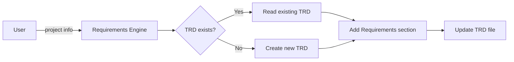

# Gather Requirements Prompt (v2)

## 🎯 Goal
Extract crystal-clear business requirements and add them to the TRD document—no fluff.

## 📋 Context Assessment
Before gathering requirements, assess the existing documentation and project context:

### Existing Documentation
- **Current State:** Check for existing technical specs, user stories, or project notes
- **Documentation Quality:** Evaluate completeness and currency of available documents
- **Gap Analysis:** Identify missing information that needs to be gathered

### TRD Integration
- **TRD Location:** File should be at `docs/planning/[feature-name]-trd.md`
- **Section Addition:** Add Requirements Analysis section to existing TRD or create new one
- **Consistency:** Ensure requirements align with other TRD sections if they exist

## 📥 Context (ask if missing)
1. **Project Scope** – what's being built?
2. **System Users** – what are the different user types?
3. **Business Objectives** – why does this exist?
4. **Current State** – legacy systems / processes?
5. **Feature Name** – for TRD filename (e.g., "user-authentication", "payment-processing")

## 🚦 Skip if
- A validated requirements section exists in TRD (<30 days) or scope is trivial/emergency.

## 🔍 Checklist
- **System Users**  
  - [ ] End users, system administrators, integrations  

- **Functional**  
  - [ ] Core features & workflows  
  - [ ] Business rules & data needs  
  - [ ] Integrations & touchpoints  

- **NFR**  
  - [ ] Performance, security, usability, reliability, scalability  

- **Constraints**  
  - [ ] Tech stack, performance, security, regulations  

- **Doc Hygiene**  
  - [ ] Unique IDs, priority (MoSCoW), acceptance criteria, dependencies  

## 📤 Output
1. Gather insights from the user directly
2. Generate comprehensive requirements documentation
3. **Add/Update in TRD:** `docs/planning/[feature-name]-trd.md`

### TRD Section Structure
Add the following section to the TRD document:

```markdown
## 2. Requirements Analysis

### 2.1 Executive Summary
[Goals & scope from business perspective]

### 2.2 System Users
[User types & their requirements in table format]

### 2.3 Functional Requirements
| ID | Description | Priority | Acceptance Criteria | Dependencies |
|----|-------------|----------|-------------------|--------------|
| REQ-001 | [Description] | Must/Should/Could/Won't | [Criteria] | [Dependencies] |

### 2.4 Non-Functional Requirements
| ID | Category | Requirement | Target | Measurement |
|----|----------|-------------|---------|-------------|
| NFR-001 | Performance | Response time | <200ms | API response time |

### 2.5 Business Constraints
- [Constraint 1]
- [Constraint 2]

### 2.6 Assumptions & Dependencies
**Assumptions:**
- [Assumption 1]

**Dependencies:**
- [Dependency 1]

### 2.7 Open Questions
- [Question requiring clarification]
```

**Note:** If TRD file doesn't exist, create it with basic structure. If it exists, read current content and add/update the Requirements Analysis section while preserving other sections.

## ➡️ Response Flow

