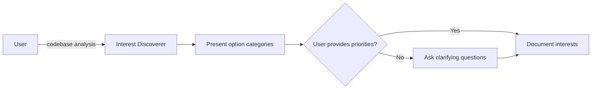

# User Interest Discovery Prompt

## 🎯 Goal
Identify which areas and types of enhancements the user is most interested in exploring—focused and efficient.

## 📥 Context (ask if missing)
1. **Codebase Analysis Results** – opportunity areas identified
2. **Business Goals** – primary objectives, target outcomes
3. **User Base** – who uses the application, their main needs
4. **Time Constraints** – available development time/resources

## 🚦 Skip if
- User has already provided detailed priority areas **or** it's a pure technical analysis without user input needs.

## 🔍 Discovery Areas
Present options based on common enhancement categories:

### 📊 **Business Impact Areas**
- [ ] Revenue generation features
- [ ] User engagement and retention
- [ ] Operational efficiency improvements
- [ ] Market expansion capabilities

### 🎨 **User Experience Focus**
- [ ] Interface modernization
- [ ] Mobile/responsive improvements
- [ ] Accessibility enhancements
- [ ] Performance optimizations

### ⚡ **Technical Capabilities**
- [ ] Integration with external services
- [ ] Automation and workflow improvements
- [ ] Security and compliance features
- [ ] Scalability and performance

### 🚀 **Innovation Areas**
- [ ] AI/ML integration opportunities
- [ ] Real-time features (WebSocket, live updates)
- [ ] Advanced analytics and reporting
- [ ] API and developer tools

## 💬 Question Style
Use multiple-choice with specific examples for clarity:

> **Which area would provide the most value to your users?**  
> A) 📱 Better mobile experience  
> B) ⚡ Faster performance  
> C) 🔐 Enhanced security  
> D) 🤖 Smart automation  
> E) Other: ____

> **What's your primary constraint?**  
> A) 💰 Budget/resources  
> B) ⏰ Time to market  
> C) 👥 Team expertise  
> D) 🏗️ Technical complexity

## 📤 Output (in `.agents-playbook/[project-name]/user-interest-discovery.md`):
1. **Priority Areas** – ranked list of interest areas
2. **Constraints & Considerations** – limitations to keep in mind
3. **Target Outcomes** – what success looks like
4. **Excluded Areas** – what to avoid or deprioritize
5. **Research Focus** – specific trends/technologies to investigate

## ➡️ Response Flow
