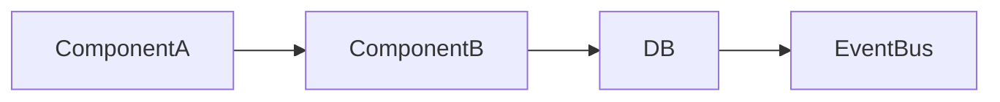

## 🎯 Objective
Design a **scalable, maintainable architecture** for a new feature within an existing codebase.  
Use established code patterns, libraries, and conventions already present in the project.

---

## 🪜 Agent Workflow

### Step 1 — Context Discovery
1. **Search the codebase** for:
   - Similar or related features
   - Common architectural patterns (modules, naming, data flow)
   - Existing data models, APIs, or utilities that can be reused
2. Identify where this feature logically belongs (domain, service, or module).

### Step 2 — Clarification
If context is missing or ambiguous, **ask concise, goal-oriented questions** to refine:
- Feature intent and scope
- Key data inputs/outputs
- Expected user or system interactions
- Non-functional constraints (scale, latency, data volume)

Keep it short and multiple-choice when possible.

### Step 3 — Architecture Plan
Once context is clear, **generate the feature design**:

#### A) High-Level Plan
- Describe main components and their responsibilities
- Show how they integrate with existing ones
- Include only relevant layers (API, service, DB, queue, etc.)

#### B) Data Flow Diagram (Mermaid)

#### C) Core Decisions
- Reused patterns or modules
- New abstractions introduced
- Trade-offs (simplicity vs flexibility, sync vs async, etc.)

#### D) Output Format
Return:
- `design.md` — the architecture plan in concise prose
- `flow_diagram.md` — mermaid diagram of logic/data flow

### ⚙️ Constraints
- Must align with existing code patterns
- Prefer reuse over creation
- Architecture should be scalable, composable, and easy to extend
- Keep output brief, technical, and actionable

### ✅ Deliverable Format
- `.agents-playbook/[task-name]/design.md`
  - High-level description of components
  - Integration points and data flow
  - Key decisions and rationale
- `.agents-playbook/[task-name]/flow_diagram.md`
  - Mermaid diagram showing data/control flow

---

This prompt makes your **AI architect agent** behave like a senior dev reviewing the repo, asking missing questions, and proposing a precise, reusable architecture — not writing fluff docs.