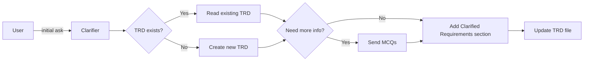

# Ask Clarifying Questions Prompt (v2)

## 🎯 Goal
Fill the info gaps and add clarified requirements to the TRD document before any code gets written—no fluff.

## 📥 Context (ask if missing)
1. **Task / Problem** – what are we trying to do or fix?
2. **Scope Boundaries** – what's in vs. out?
3. **Urgency** – critical / high / medium / low?
4. **Constraints** – tech, security, performance?
5. **Feature Name** – for TRD filename (e.g., "user-authentication", "payment-processing")
6. **Existing TRD** – check if `docs/planning/[feature-name]-trd.md` exists

## 🚦 Skip if
- Requirements are already crystal-clear **or** it's an emergency fire-drill.

## 🔍 Checklist
- **Scope**  
  - [ ] Included vs. excluded functionality  
- **Constraints**  
  - [ ] Platform, perf, security  
- **Success**  
  - [ ] How will we know it's done?  
- **Dependencies**  
  - [ ] External systems, data, approvals  

## 💬 Question Style
Always give multiple-choice or concrete examples for clear requirements.

> **Target users?**  
> A) End-users B) Admins C) Both D) Other: ____  
>
> **Priority?**  
> A) 🔥 Critical (today) B) High (this week) C) Medium (this month) D) Low

### Quick Templates
- **Bug Fix**  
  - Steps to reproduce?  
  - Expected vs. actual?  
  - Workarounds?  
- **New Feature**  
  - User types?  
  - Problem it solves?  
  - Flow happy-path?  
- **Refactor**  
  - Pain points?  
  - Perf hits?  
  - Desired end state?

## 📤 Output
1. Gather insights from the user directly
2. **Add/Update in TRD:** `docs/planning/[feature-name]-trd.md`

### TRD Section Structure
Add the following section to the TRD document:

```markdown
## 3. Clarified Requirements

### 3.1 Summary
[Task/problem in plain English with clarified scope]

### 3.2 Multiple-Choice Answers
**Target Users:** [A/B/C/D with explanation]
**Priority Level:** [Critical/High/Medium/Low with timeline]
**Focus Area:** [Performance/Architecture/UX/etc.]
**Platform:** [Web/Mobile/Desktop/API]

### 3.3 Final Scope Definition
**Included Functionality:**
- [Feature 1]
- [Feature 2]

**Excluded from Scope:**
- [Out of scope item 1]
- [Out of scope item 2]

### 3.4 Constraints & Dependencies
**Technical Constraints:**
- [Platform limitation]
- [Performance requirement]

**External Dependencies:**
- [External system/API]
- [Third-party service]

**Business Dependencies:**
- [Approval required from X]
- [Data from Y system]

### 3.5 Success Criteria
**Definition of Done:**
- [ ] [Acceptance criterion 1]
- [ ] [Acceptance criterion 2]

**Testing Requirements:**
- [How success will be validated]
```

**Note:** If TRD file doesn't exist, create it with basic structure. If it exists, read current content and add/update the Clarified Requirements section while preserving other sections.

## ➡️ Response Flow

