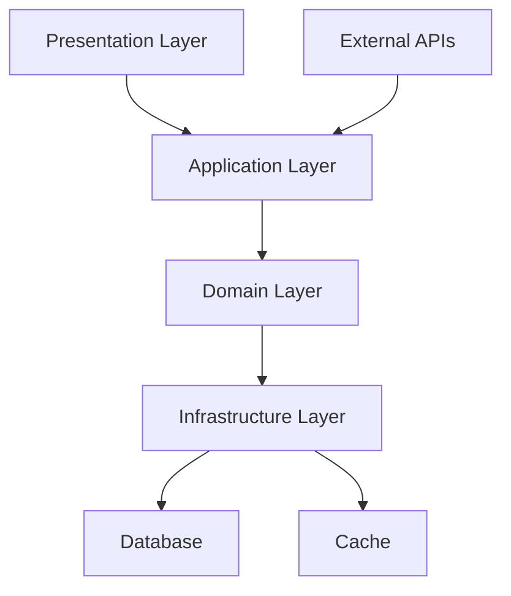
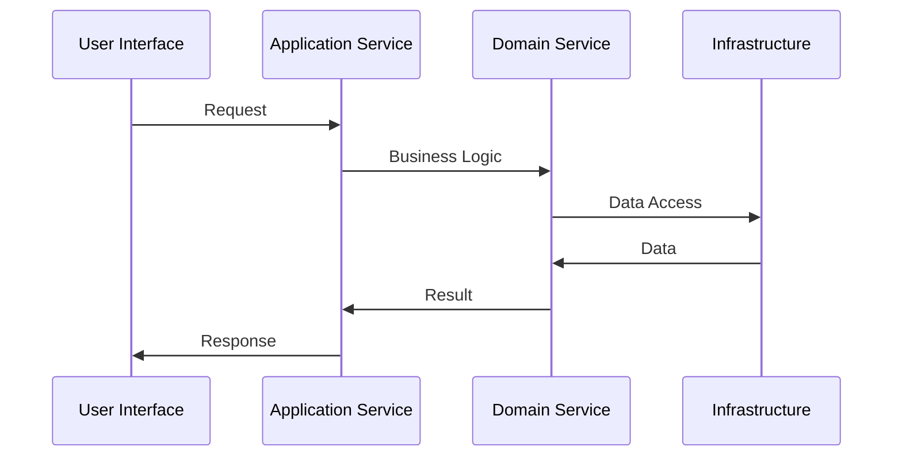
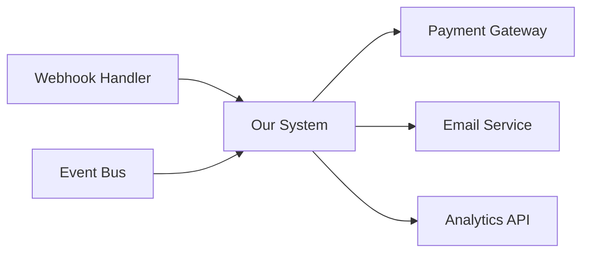
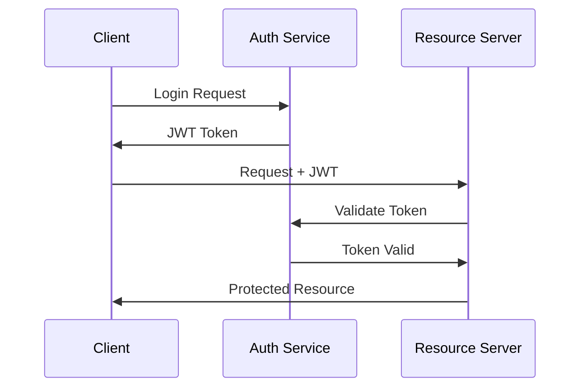
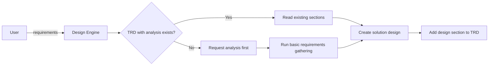

# Design Architecture Prompt (v2)

## 🎯 Goal
Create detailed solution design and technical architecture, adding it to the TRD document as a bridge between analysis and implementation—no fluff.

## 📥 Context (ask if missing)
1. **Feature** – what are we designing/building?
2. **Requirements** – functional + non-functional needs
3. **Constraints** – tech stack, performance, security, compliance
4. **Integration** – external systems, APIs, data sources
5. **Feature Name** – for TRD filename (e.g., "user-authentication", "payment-processing")
6. **Existing TRD** – check if `docs/planning/[feature-name]-trd.md` exists with analysis sections

## 🚦 Skip if
- A validated technical design exists in TRD (<30 days) or it's a trivial change.

## 🔍 Design Checklist
- **Architecture Patterns**  
  - [ ] Overall system pattern (MVC, Clean, Hexagonal, etc.)
  - [ ] Component interaction patterns
  - [ ] Data flow patterns

- **Component Design**  
  - [ ] Service/module boundaries
  - [ ] Interface definitions
  - [ ] Dependency management

- **Data Architecture**  
  - [ ] Storage design (relational, NoSQL, cache)
  - [ ] Data flow and transformations
  - [ ] Consistency and transaction patterns

- **Integration Design**
  - [ ] API design and contracts
  - [ ] External service integration
  - [ ] Event/messaging patterns

- **Quality Attributes**
  - [ ] Performance characteristics
  - [ ] Security model
  - [ ] Scalability approach

## 📤 Output
1. Create comprehensive solution design based on analysis
2. **Add/Update in TRD:** `docs/planning/[feature-name]-trd.md`

### TRD Section Structure
Add the following section to the TRD document:

```markdown
## 6. Solution Design

### 6.1 Architecture Overview
**Design Philosophy:** [Clean Architecture/DDD/Microservices/etc.]
**Core Patterns:** [MVC, Repository, Factory, Observer, etc.]



### 6.2 Component Architecture
**Layer Responsibilities:**
- **Presentation:** [UI components, controllers, API endpoints]
- **Application:** [Use cases, orchestration, business workflows]
- **Domain:** [Business logic, entities, domain services]
- **Infrastructure:** [Data access, external integrations, utilities]

**Component Interactions:**


### 6.3 Data Architecture Design
**Storage Strategy:**
- **Primary Store:** [PostgreSQL/MongoDB/etc. with rationale]
- **Caching:** [Redis/Memcached for performance]
- **Search:** [Elasticsearch/etc. for complex queries]

**Data Models:**
```typescript
// Core domain entities
interface User {
  id: UserId;
  email: Email;
  profile: UserProfile;
  createdAt: Date;
}

interface UserProfile {
  firstName: string;
  lastName: string;
  preferences: UserPreferences;
}
```

**Repository Pattern:**
```typescript
interface UserRepository {
  findById(id: UserId): Promise<User | null>;
  save(user: User): Promise<void>;
  findByEmail(email: Email): Promise<User | null>;
}
```

### 6.4 API Design
**RESTful Design Principles:**
- Resource-based URLs
- HTTP methods mapping to CRUD
- Consistent response formats
- Proper status codes

**API Contract:**
```yaml
# OpenAPI 3.0 specification excerpt
paths:
  /api/users:
    get:
      summary: List users
      parameters:
        - name: page
          in: query
          schema:
            type: integer
      responses:
        200:
          description: Users list
          content:
            application/json:
              schema:
                type: object
                properties:
                  users:
                    type: array
                    items:
                      $ref: '#/components/schemas/User'
```

### 6.5 Integration Architecture
**External Service Integration:**


**Integration Patterns:**
- **Synchronous:** REST APIs for real-time operations
- **Asynchronous:** Message queues for background processing
- **Event-driven:** Domain events for decoupling

### 6.6 Security Architecture
**Authentication Flow:**


**Authorization Model:**
- **RBAC:** Role-based access control
- **Claims-based:** Fine-grained permissions
- **Resource-level:** Object-specific permissions

### 6.7 Performance Architecture
**Caching Strategy:**
- **Application Cache:** In-memory for frequently accessed data
- **Database Cache:** Query result caching
- **CDN:** Static asset delivery

**Optimization Patterns:**
- **Lazy Loading:** Load data on demand
- **Connection Pooling:** Database connection management
- **Batch Operations:** Reduce round trips

### 6.8 Error Handling Design
**Error Categories:**
```typescript
enum ErrorType {
  VALIDATION = 'VALIDATION',
  BUSINESS_RULE = 'BUSINESS_RULE', 
  EXTERNAL_SERVICE = 'EXTERNAL_SERVICE',
  SYSTEM = 'SYSTEM'
}

interface DomainError {
  type: ErrorType;
  code: string;
  message: string;
  details?: any;
}
```

**Error Propagation:**
- Domain errors bubble up through layers
- Infrastructure errors are wrapped and translated
- User-facing errors are sanitized

### 6.9 Testing Strategy
**Testing Pyramid:**
- **Unit Tests:** Domain logic, pure functions
- **Integration Tests:** Repository implementations, API endpoints
- **Contract Tests:** External service interactions
- **E2E Tests:** Critical user journeys

**Test Architecture:**
```typescript
// Example test structure
describe('UserService', () => {
  describe('createUser', () => {
    it('should create user with valid data', async () => {
      // Arrange
      const userData = validUserData();
      
      // Act
      const result = await userService.createUser(userData);
      
      // Assert
      expect(result).toMatchObject(expectedUser);
    });
  });
});
```

### 6.10 Deployment Architecture
**Environment Strategy:**
- **Development:** Local + Docker containers
- **Staging:** Production-like environment
- **Production:** Containerized deployment

**Infrastructure as Code:**
```yaml
# Docker Compose example
version: '3.8'
services:
  app:
    build: .
    ports:
      - "3000:3000"
    environment:
      - DATABASE_URL=${DATABASE_URL}
  
  db:
    image: postgres:15
    environment:
      - POSTGRES_DB=app
```
```

**Note:** This design section bridges the gap between analysis (sections 2-5) and technical implementation. Include detailed diagrams and code examples to guide implementation.

## ➡️ Response Flow

