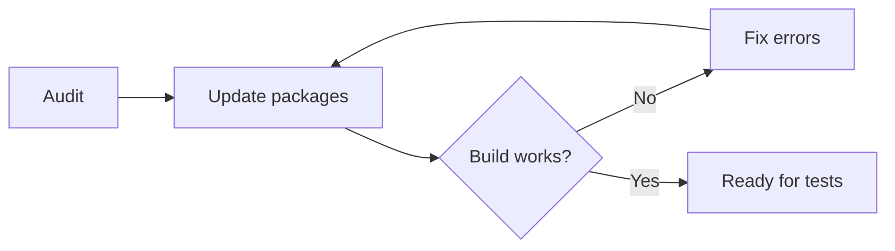

# Implement Updates Prompt

## 🎯 Goal
Update dependencies safely with immediate validation checks.

## ⚠️ Before You Start
**IMPORTANT**: Make sure your code is committed to git first! You'll need a clean working state to rollback if something goes wrong.

## 📥 Context (ask if missing)
1. **Audit Results** – which packages to update and priority level
2. **Breaking Changes List** – any API changes to watch for
3. **Library Usage** – where and how updated libraries are used in codebase

## 🚦 Skip if
- Updates already implemented **or** working directory not clean.

## 🔍 Checklist
- [ ] Verify git status is clean: `git status`
- [ ] Update packages one group at a time (patch → minor → major)
- [ ] Run `npm install` and check for conflicts
- [ ] Verify build still works: `npm run build`
- [ ] Fix any TypeScript or linting errors
- [ ] For breaking changes: check latest docs via Context7 MCP tool, fallback to web search
- [ ] Update code where updated libraries are used (imports, API calls, config)
- [ ] Test basic app functionality

## 📤 Output
1. **What was updated**: List packages and new versions
2. **Issues found**: Any conflicts or errors encountered  
3. **Code changes**: Breaking change fixes and library usage updates applied
4. **Documentation consulted**: Which libs required doc lookup for migration
5. **Status**: Ready for testing or needs more work

## ➡️ Response Flow
