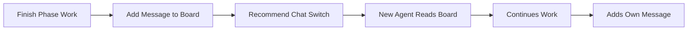

# Handoff Memory Board (v1)

## 🎯 Goal
Shared memory board where agents write messages to each other during phase transitions - like a persistent conversation board.

## 📥 Context (ask if missing)
1. **Workflow Name** – which workflow is running
2. **Current Phase** – what just finished
3. **Next Phase** – what's starting next
4. **Key Outcomes** – what was accomplished/decided

## 🚦 Skip if
- Same agent continuing without interruption **or** trivial single-step task.

## 📋 Memory Board Structure
**File:** `.agents-playbook/[feature-or-task-name]/memory-board.md`

This is a **persistent conversation board** - each agent adds their message at the bottom.

```markdown
# Memory Board: [Workflow Name]

## Agent Messages (Latest at Bottom)

### [Agent Name] - [Phase] → [Next Phase] - [Timestamp]
**What I accomplished:**
- [Key achievement 1]
- [Key achievement 2]

**Files/artifacts created:**
- [File location and purpose]

**Important decisions made:**
- [Decision and rationale]

**For the next agent:**
- [Critical info to know]
- [Watch out for this issue]
- [Context that matters]

**Questions/blockers:**
- [Unresolved item 1]
- [Need clarification on X]

---

### [Next Agent Name] - [Phase] → [Next Phase] - [Timestamp]
**Starting with:**
- [Understanding of handoff]

**Progress so far:**
- [What I'm working on]

**Questions for previous agent:**
- [If I need clarification]

---

(Each agent continues adding messages...)
```

## 🔄 **CHAT TRANSITION PROMPT**

**Before switching chats, add your message to the memory board.**

**For the next chat session:**
```
I'm continuing a [workflow-name] workflow at the [current-phase] phase.

Please read our memory board: .agents-playbook/[feature-or-task-name]/memory-board.md

Latest context: [2-3 key points from the board]

Ready to continue with [next-phase].
```

## 📝 Quick Message Template

```
### [Your Role] - [Current Phase] → [Next Phase] - [Date/Time]
**Completed:** [What was done]
**Created:** [Files/artifacts] 
**Decided:** [Key decisions]
**Next agent needs:** [Critical context]
**Watch out for:** [Warnings/issues]
**Questions:** [Unresolved items]
```

## ➡️ Usage Flow
