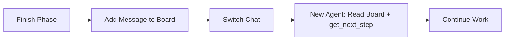

# Handoff Memory Board (v1)

## 🎯 Goal
Shared memory board where agents write messages to each other during phase transitions - like a persistent conversation board.

## 📥 Context (ask if missing)
1. **Workflow Name** – which workflow is running
2. **Current Phase** – what just finished
3. **Next Phase** – what's starting next
4. **Key Outcomes** – what was accomplished/decided

## 🚦 Skip if
- Trivial single-step task.

## 📋 Memory Board Structure
**File:** `.agents-playbook/[feature-or-task-name]/memory-board.md`

This is a **persistent conversation board** - each agent adds their message at the bottom.

```markdown
# Memory Board: [Workflow Name]

## Agent Messages (Latest at Bottom)

### [Agent Name] - [Phase] → [Next Phase] - [Timestamp]
**What I accomplished:**
- [Key achievement 1]
- [Key achievement 2]

**Files/artifacts created:**
- [File location and purpose]

**Important decisions made:**
- [Decision and rationale]

**For the next agent:**
- [Critical info to know]
- [Watch out for this issue]
- [Context that matters]

**Questions/blockers:**
- [Unresolved item 1]
- [Need clarification on X]

**Unobvious learnings:**
- [Something that wasn't clear initially but became obvious]
- [Gotcha or insight that could save time later]

---

### [Next Agent Name] - [Phase] → [Next Phase] - [Timestamp]
**Starting with:**
- [Understanding of handoff]

**Progress so far:**
- [What I'm working on]

**Questions for previous agent:**
- [If I need clarification]

---

(Each agent continues adding messages...)
```

## ⚠️ **REQUIRED ACTION**
**You MUST ask the user:** "Would you like to switch to a new chat for the next phase? (YES/NO)"

## 🔄 **CHAT TRANSITION PROMPT**

**Before switching chats, add your message to the memory board.**

**If YES, use this template in your new chat:**
```
I'm continuing a [workflow-name] workflow at step [step-number].

Please read our memory board: .agents-playbook/[feature-or-task-name]/memory-board.md

**Workflow State (if using MCP workflows):**
- Workflow ID: "[workflow-id]"
- Current Step: [step-number] 
- Available Context: [context-list]
- Next Action: Use `get_next_step` with above state

Latest context: [2-3 key points from the board]

Ready to continue with [next-phase].
```

## 📝 Quick Message Template

```
### [Your Role] - [Current Phase] → [Next Phase] - [Date/Time]
**Completed:** [What was done]
**Created:** [Files/artifacts] 
**Workflow State:** [workflow_id="...", current_step=X, context=[...]]
**Next agent needs:** [Critical context]
**Questions:** [Unresolved items]
**Learnings:** [Non-obvious insights discovered during work]
```

## ➡️ Usage Flow
