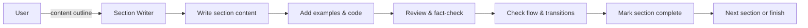

# Implement Article Writing Prompt (v1)

## 🎯 Goal
Execute systematic article writing following the content outline and task breakdown, producing high-quality technical content with proper structure, examples, and engaging narrative.

## 📋 General Instructions
- **Follow outline precisely** - write exactly what was planned in the content structure
- **Maintain consistent voice** - keep tone appropriate for technical audience and platform
- **Include practical examples** - add code samples, real-world scenarios, and actionable insights
- **Critical review each section** - ensure quality, accuracy, and flow before moving to next section

## 📥 Context (ask if missing)
1. **Content Outline** – `.agents-playbook/[article-topic]/tasks.md` with section breakdown
2. **Article Requirements** – `.agents-playbook/[article-topic]/article-requirements.md` with scope and research
3. **Research Materials** – sources, examples, and reference materials gathered
4. **Platform Guidelines** – specific requirements for target publication platform

## 🚦 Skip if
- Article already exists and meets quality requirements
- Content outline is incomplete or hasn't been validated

## ✍️ Article Writing Process

### **Follow Task Breakdown Structure**
Execute each section exactly as outlined in `tasks.md`:

```
- [ ] 1. Article Introduction
  - [ ] 1.1 Write opening hook
    - [ ] 1.1.1 Review and fact-check introduction
- [ ] 2. Core Content Sections  
  - [ ] 2.1 Write [specific section]
    - [ ] 2.1.1 Review and fact-check section
```

### **Section Writing Guidelines**

**Introduction Requirements:**
- Compelling hook that draws readers in
- Clear problem statement or context
- Article value proposition (what readers will learn)
- Brief roadmap of what's covered

**Core Content Requirements:**
- Logical flow between sections
- Practical examples and code samples where applicable
- Clear explanations of complex concepts
- Actionable insights readers can implement

**Conclusion Requirements:**
- Summary of key takeaways
- Next steps or call to action
- Links to additional resources if relevant

### **Quality Standards for Each Section**
- [ ] **Accuracy** – all technical information is correct and up-to-date
- [ ] **Clarity** – concepts explained clearly for target audience level
- [ ] **Examples** – concrete examples that illustrate key points
- [ ] **Flow** – smooth transitions between ideas and sections
- [ ] **Engagement** – maintains reader interest throughout
- [ ] **Actionability** – readers can apply what they've learned

## 📝 Writing Best Practices

### **Technical Content:**
- Use clear, concise code examples with proper syntax highlighting
- Explain code snippets and their purpose
- Include error handling and edge cases where relevant
- Provide working examples readers can test

### **Structure & Flow:**
- Use descriptive headings and subheadings
- Break up long sections with lists, code blocks, or examples
- Include smooth transitions between major sections
- End sections with brief summaries when helpful

### **Engagement Techniques:**
- Start with relatable problems or scenarios
- Use "you" to directly address the reader
- Include personal insights or lessons learned
- Ask rhetorical questions to maintain engagement

## 📤 Output
**File:** `.agents-playbook/[article-topic]/article.md`

### Article Structure:
```markdown
# [Article Title]

## Introduction
[Compelling opening that hooks readers and explains article value]

## [Section 1 Title]
[First major content section with examples and explanations]

### [Subsection if needed]
[Detailed content following outline structure]

```javascript
// Code example with clear comments
function exampleCode() {
    // Explanation of what this does
    return "practical example";
}
```

## [Section 2 Title]  
[Second major content section continuing logical flow]

## [Additional Sections]
[Following the exact structure from tasks.md]

## Conclusion
[Summary of key takeaways and next steps]

### Key Takeaways
- [Main point 1]
- [Main point 2] 
- [Main point 3]

### Next Steps
[Actionable items readers can pursue]

### Additional Resources
- [Relevant links and references]
```

## ✅ Section Review Checklist
For each completed section, verify:
- [ ] **Content matches outline** – follows planned structure exactly
- [ ] **Technical accuracy** – all information is correct and tested
- [ ] **Target audience fit** – appropriate depth and complexity
- [ ] **Examples included** – practical illustrations of key concepts
- [ ] **Smooth transitions** – flows well to/from adjacent sections
- [ ] **Engaging tone** – maintains reader interest
- [ ] **Grammar & style** – professional writing quality

## 🔄 Iterative Writing Process
1. **Draft section** – write initial version following outline
2. **Review & refine** – check against quality standards  
3. **Add examples** – include relevant code/scenarios
4. **Verify accuracy** – fact-check technical details
5. **Check flow** – ensure smooth transition to next section
6. **Mark complete** – update task checklist

## 🔗 Integration Notes
This prompt works with:
- **tasks.md** - follows the exact section breakdown and task structure
- **article-requirements.md** - ensures content meets scope and audience needs  
- **research materials** - incorporates findings and sources appropriately
- **platform guidelines** - adapts formatting and style for target publication

## ➡️ Response Flow


## 💡 Writing Tips
- **Start with structure** – follow the outline exactly, resist urge to deviate
- **Write first, edit later** – get ideas down, then refine for quality
- **Test your examples** – ensure all code samples actually work
- **Read aloud** – check flow and identify awkward phrasing
- **Consider your reader** – what questions would they have at each point?
