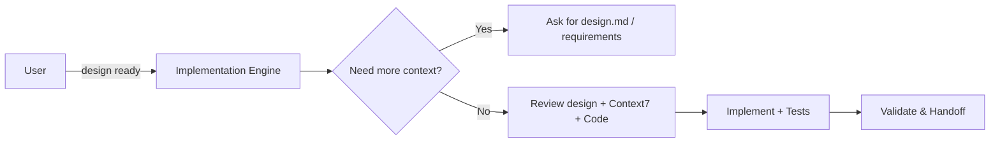

# Implement Quick Feature

## 🎯 Goal
Execute feature implementation directly from design specifications with clean, secure, performant code and comprehensive test coverage. **Consider alternative implementation approaches and choose the most appropriate one.**

## 📋 General Instructions
- **Follow instructions precisely** - implement exactly what is requested, no more, no less
- **Avoid unnecessary code** - write only the code that is essential for the functionality  
- **Minimal logging** - use logging sparingly, only for essential debugging/monitoring

## 🎯 Universal Implementation Rules
1. Do not over-engineer and make precise fixes
2. Use only static imports
3. Do not add excessive markdown files and console logs
4. Do not use any work arounds, hacks and fallbacks
5. Validate and document each step
6. Do not use "any" or "unknown" types or any fallbacks or hacks
7. Do not pass functions as dependencies to hooks
8. Name functions and variables and classes technically or business wise
9. Follow strict typisation if applicable
10. Fix lint errors and do not write code which is not used
11. Locate existing design system or UI components if applicable
12. Use context7 MCP if available for documentation if applicable

## 📥 Context (ask if missing)
1. **Design Spec** – `.agents-playbook/[task-name]/design.md` with architecture, diagrams & implementation approach
2. **Flow Diagram** – `.agents-playbook/[task-name]/flow_diagram.md` with data flow and transformations
3. **Requirements File** – `.agents-playbook/[task-name]/requirements.md` with original user stories & acceptance criteria (if available)
4. **Repo Access** – branch / directory path.  
5. **Dev Environment** – setup quirks, build tools, secrets manager?

## 📋 Preparation Steps
**Before implementation:** Verify Context7 MCP access and fetch fresh documentation for libraries that may have updates since AI training cutoff (React, Next.js, testing frameworks, etc.) if needed (you can check package.json or any version file)

## 🔍 Implementation Flow
**Work directly from design.md specifications:**

1. **Review Design** – understand architecture, components, and technical approach from design.md
2. **Implementation Strategy** – break down design into logical implementation steps
3. **Implement** – write the code following design specifications
4. **Validate** – test functionality meets requirements
5. **Unit Tests** – write comprehensive test coverage
6. **Integration** – ensure all components work together per flow_diagram.md

### Implementation Strategy
- [ ] Review design.md thoroughly before starting
- [ ] Use vertical slice approach: implement complete user scenarios end-to-end
- [ ] Follow architecture and component design from design.md
- [ ] Reference flow_diagram.md for data transformations
- [ ] For UI work, reference `.agents-playbook/ui.json` if it exists or locate existing design system

### Implementation Categories (from design.md):
1. **Core Logic** – business rules first.  
2. **Data Layer** – models, migrations, validation.  
3. **API** – endpoints, request/response schema.  
4. **Integrations** – external services, queues, webhooks.  
5. **UI** – components, state mgmt, a11y.  
6. **Cross-Cutting** – logging, monitoring, error handling, auth.  
7. **Libraries & Dependencies** – refer to fresh documentation gathered in Preparation Steps; use Context7 for any additional library queries during implementation.  

### Quality Gates
- [ ] Implementation follows design.md specifications exactly
- [ ] All components from design.md are implemented
- [ ] Data flow matches flow_diagram.md
- [ ] Functionality validated against requirements
- [ ] Unit tests written and passing with good coverage
- [ ] Integration tests for component interactions
- [ ] Follows style guide & naming conventions.  
- [ ] Inputs validated, secrets via env/manager.  
- [ ] No hard-coded limits; efficient queries.
- [ ] **Remove old code**: Clean up old logging, debug statements, commented code, unused functions

## 🛠️ Common Patterns
Repository • Service • Factory • Middleware • Decorator • Observer

## 📤 Output
1. **Implementation code** – following design.md specifications exactly
2. **Unit tests** – comprehensive test coverage for all components
3. **Integration tests** – verify component interactions per flow_diagram.md
4. **🔄 Sub-Agent Handoff** – update memory board for next sub-agent (if applicable)

Sections:
1. **Implemented Components** – list of components/features completed
2. **Implementation Notes** – code decisions, patterns used, deviations from design (if any)
3. **Test Coverage** – tests written with coverage metrics
4. **Validation Results** – functionality testing results
5. **Next Steps** – any follow-up work or handoff needed
6. **Blockers** – any issues preventing completion

## 🔄 Completion & Handoff
**When implementation is complete:**
1. **Verify all design.md requirements** - ensure everything specified is implemented
2. **Run all tests** - unit and integration tests must pass
3. **Update memory board** - Document what was completed (if handoff needed)
4. **Prepare context** - Summarize deliverables for next phase (if applicable)

## ➡️ Response Flow

