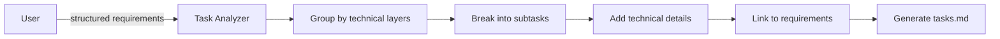

# Create Implementation Plan & Task Breakdown Prompt (v1)

## 🎯 Goal
Generate detailed implementation plan (tasks.md) with hierarchical task breakdown, technical specifications, and requirement traceability for systematic development execution.

## 📋 General Instructions
- **Follow instructions precisely** - implement exactly what is requested, no more, no less
- **Avoid unnecessary code** - write only the code that is essential for the functionality  
- **Minimal logging** - use logging sparingly, only for essential debugging/monitoring
- **Critical review** - always step back and assess if the solution aligns with requirements and best practices

## 📥 Context (ask if missing)
1. **Requirements File** – `.agents-playbook/[task-name]/requirements.md` with User Stories and Acceptance Criteria
2. **Design Spec** – `.agents-playbook/[task-name]/design.md` with technical architecture and system components
3. **Technology Stack** – frameworks, libraries, and tools to be used
4. **Development Environment** – existing codebase patterns and standards
5. **Team Capabilities** – available skills and resources for planning

## 🚦 Skip if
- Implementation plan already exists (<30 days) or feature is too simple for detailed breakdown

## 🔍 Task Breakdown Strategy

### **Code Patterns Analysis First**
- [ ] **Analyze Existing Patterns** – review codebase for established architectural patterns
- [ ] **Extract Best Practices** – identify coding conventions, naming standards, and reusable components
- [ ] **Document Standards** – note error handling, testing, and logging patterns currently in use

### **Task Grouping Principles** (Following Existing Patterns)
- **Data Layer First** – database, models, migrations following existing data patterns
- **API Layer Second** – backend endpoints and business logic using established API conventions  
- **UI Components Third** – user interface and interactions leveraging existing component patterns
- **Integration Fourth** – connecting components and systems using current integration approaches
- **Testing & Polish Fifth** – validation, error handling, optimization following existing standards

### **Task Hierarchy Format**
```
- [ ] 1. Major Task Group
  - High-level description of what needs to be implemented
  - Key technical considerations and dependencies
  - _Requirements: X.X, X.X_

  - [ ] 1.1 Specific Subtask
    - Detailed implementation steps
    - Specific technical requirements and acceptance criteria
    - _Requirements: X.X, X.X_
    
    - [ ] 1.1.1 Critical review and write tests
      - Make critical review of the implementation
      - Verify all acceptance criteria met
      - Write unit tests for core logic (optional for simple tasks)
      - Write integration tests if applicable (optional)
```

## 📋 Implementation Plan Structure

### **Required Sections**
1. **Database & Data Models** – schema, migrations, relationships
2. **API Development** – endpoints, validation, authentication
3. **Frontend Components** – pages, components, interactions
4. **Core Functionality** – business logic and main features
5. **User Interface & Experience** – design implementation, responsive
6. **Integration & Data Flow** – connecting all components
7. **Error Handling & Validation** – robust error management
8. **Testing & Quality Assurance** – comprehensive test coverage
9. **Performance & Optimization** – responsive, efficient implementation

## ✅ Quality Requirements for Each Task
- [ ] **Clear Scope** – specific, actionable task description
- [ ] **Technical Details** – implementation approach specified
- [ ] **Acceptance Criteria** – clear definition of done
- [ ] **Requirement Traceability** – linked to specific requirements
- [ ] **Critical Review and Test Step** – explicit critical review and testing subtask after implementation (tests optional)
- [ ] **Dependencies** – prerequisites and order clearly defined

## 🔄 Mandatory Task Flow
Each implementation task MUST include:
1. **Implementation** – core development work
2. **Critical review and write tests** – verify functionality meets requirements and write tests (tests optional for simple tasks)

## 🔗 Requirement Linking Format
Each task must include:
```
_Requirements: 2.1, 2.3, 4.1_
```
Where numbers refer to specific requirements from structured requirements document.

## 📤 Output
**File:** `.agents-playbook/[feature-name]/tasks.md`

### Document Structure:
```markdown
# Implementation Plan

- [ ] 1. Set up database schema and core data models
  - [High-level description of data layer work]
  - _Requirements: X.X, X.X_

  - [ ] 1.1 Create data models
    - [Specific technical implementation details]
    - _Requirements: X.X_
    
    - [ ] 1.1.1 Critical review and write tests for data models
      - Test model relationships and constraints
      - Verify data integrity and validation rules
      - Write unit tests for model methods (optional for simple models)
      - Write database integration tests (optional)

- [ ] 2. Create API endpoints
  - [API layer description]
  - _Requirements: X.X, X.X_

  - [ ] 2.1 Implement GET endpoints
    - [Detailed implementation steps]
    - _Requirements: X.X_
    
    - [ ] 2.1.1 Critical review and write tests for GET endpoints
      - Test all endpoints return correct data
      - Verify error handling and edge cases
      - Write unit tests for endpoint logic (optional for simple endpoints)
      - Write integration tests for full request/response cycle (optional)
```

## 🎯 Task Planning Guidelines

### **Task Sizing**
- **Major Groups (1-10)** – Can take 1-3 days to complete
- **Subtasks (X.1-X.N)** – Should be completable in 2-6 hours
- **Atomic Actions** – Each checkbox represents a specific deliverable

### **Dependency Management** 
- Order tasks by logical dependencies (data → API → UI → integration)
- Ensure each task has clear prerequisites
- Group related tasks to minimize context switching

### **Technical Depth**
- Include specific technology decisions (frameworks, libraries)
- Specify testing requirements for each component
- Add error handling and validation requirements
- Consider performance and scalability needs

## 🔄 Integration Notes
This prompt works with:
- **requirements.md** - uses original user stories and acceptance criteria for task creation
- **design.md** - aligns with technical architecture decisions and system design
- **tasks.md** - creates the implementation breakdown that other prompts follow
- `implement-feature.md` - provides detailed task list for systematic implementation

## ➡️ Response Flow


## 💡 Best Practices
- **Start with MVP core** – prioritize essential functionality first
- **Consider vertical slices** – complete user workflows before adding features
- **Plan for testing** – include test requirements in each task
- **Think about edge cases** – include error handling and validation
- **Plan for maintainability** – include documentation and code quality tasks
