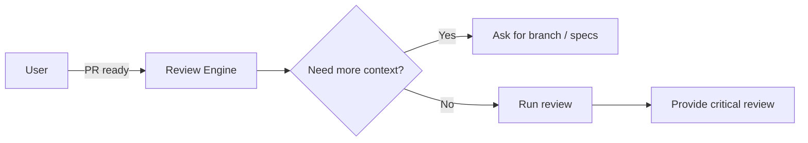

# Code Review Prompt (v3) - Critical Review

## 🎯 Goal
**CRITICALLY** audit the finished code for quality, security, performance, and standards. Be thorough, demanding, and uncompromising—catch everything before it goes to production.

## 📥 Context (ask if missing)
1. **Code Branch / PR** – where's the diff?
2. **Requirements / Specs** – doc or ticket link.
3. **Known Constraints** – perf targets, security mandates, style guide, etc.
4. **Deadline** – when do devs need feedback?

## 🚦 Skip if
- Only trivial config tweaks **or** review already done.

## 🔍 Critical Review Checklist
- **Functional** ⚡ STRICT
  - [ ] Implements ALL requirements completely
  - [ ] Handles ALL edge cases (empty inputs, max limits, failures)
  - [ ] No silent failures or incomplete logic

- **Security** 🔒 NON-NEGOTIABLE  
  - [ ] Input validation on EVERY parameter
  - [ ] SQL injection protection with prepared statements
  - [ ] XSS prevention with proper escaping
  - [ ] No hardcoded secrets, proper env/vault usage
  - [ ] Authorization checks at every entry point
  - [ ] Error messages don't leak sensitive info

- **Performance** ⚡ CRITICAL
  - [ ] No N+1 database queries 
  - [ ] Proper indexing for database operations
  - [ ] Memory leaks checked (especially in loops)
  - [ ] Async operations where appropriate
  - [ ] No blocking operations on main thread

- **Quality** 📐 MANDATORY
  - [ ] Code follows project patterns consistently
  - [ ] No duplication (DRY principle enforced)
  - [ ] Functions under 50 lines, classes under 300
  - [ ] Clear naming (no abbreviations or unclear terms)
  - [ ] No commented-out code or debug statements

- **Error Handling** 🚨 COMPREHENSIVE
  - [ ] Every external call wrapped in try/catch
  - [ ] Meaningful error messages for debugging
  - [ ] Proper logging levels (error/warn/info)
  - [ ] Graceful degradation for non-critical failures

- **Testing** 🧪 THOROUGH
  - [ ] Unit test coverage > 80% for new code
  - [ ] Integration tests for API endpoints
  - [ ] Negative test cases included
  - [ ] Tests are fast (<5s total) and deterministic  

## 📤 Critical Review Output
**Approach:** FAIL-FAST - Block merge if any Critical/High severity issues found

**Verdict:** 
- 🚦 **APPROVED** - Production ready, no issues
- 🔶 **APPROVED WITH MINOR CHANGES** - Low severity fixes only  
- 🛑 **REJECTED** - Critical/High issues must be fixed before merge

**Issue Breakdown:**

| Severity | File/Line | Category | Issue | Required Fix |
|----------|-----------|----------|-------|-------------|
| 🔴 Critical | `auth.go:42` | Security | SQL injection vulnerability | Use prepared statements |
| 🟠 High | `api.go:15` | Performance | N+1 query in loop | Implement bulk loading |
| 🟡 Medium | `utils.js:28` | Quality | 80-line function | Split into smaller functions |
| 🔵 Low | `styles.css:45` | Style | Missing semicolon | Add semicolon |

**Detailed Analysis:**
1. **Security Assessment** – Any vulnerabilities or risks  
2. **Performance Impact** – Bottlenecks, scaling concerns  
3. **Code Quality Score** – Maintainability, readability (1-10)
4. **Test Coverage Analysis** – % coverage + critical missing tests  
5. **Technical Debt Added** – New debt introduced  
6. **Deployment Risks** – What could break in production  

## ➡️ Response Flow
