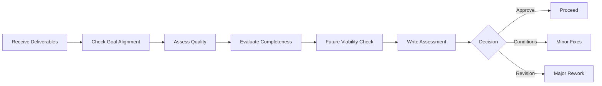

# Deliverable Review Prompt (v1)

## 🎯 Goal
Critically assess workflow deliverables for quality, completeness, and alignment with original goals - regardless of deliverable type.

## 📥 Context (ask if missing)
1. **Deliverable(s)** – what was created (docs, features, processes, etc.)
2. **Original Goals** – what was supposed to be achieved
3. **Success Criteria** – how success was defined
4. **Constraints** – time, budget, technical limitations that applied

## 🚦 Skip if
- Simple updates with minimal impact **or** deliverables already peer-reviewed and approved.

## 🔍 Universal Review Checklist

### **Goal Alignment**
- [ ] Deliverable addresses original requirements
- [ ] Success criteria met or reasonable progress made
- [ ] Scope creep identified and justified
- [ ] Value proposition clear and realized

### **Quality Assessment**
- [ ] Professional quality appropriate for audience
- [ ] Consistent with project standards
- [ ] Free of obvious errors or omissions
- [ ] Usable by intended audience

### **Completeness**
- [ ] All promised components delivered
- [ ] Dependencies and prerequisites addressed
- [ ] Documentation adequate for handoff/maintenance
- [ ] Edge cases and error scenarios considered

### **Future Viability**
- [ ] Maintainable and scalable approach
- [ ] Integration with existing systems considered
- [ ] Migration/rollback plans if applicable
- [ ] Knowledge transfer needs addressed

## 📤 Output
**File:** `.agents-playbook/[workflow-name]/deliverable-review-assessment.md`

Structure:
1. **Review Summary** – 🟢 Meets Goals / 🟡 Partial Success / 🔴 Major Issues
2. **What Worked Well** – strengths and successes
3. **Critical Issues** – problems that need immediate attention
4. **Recommendations** – improvements and next steps
5. **Lessons Learned** – insights for future work

## 📋 Assessment Template

### Review Summary
**Overall Status**: [🟢 Success / 🟡 Partial / 🔴 Issues]  
**Goal Achievement**: [X%] of original objectives met  
**Key Finding**: [Most important insight]

### Deliverable Inventory
| Deliverable | Status | Quality | Notes |
|-------------|--------|---------|-------|
| [Item 1] | ✅ Complete | High | [Comments] |
| [Item 2] | ⚠️ Partial | Medium | [Issues] |

### What Worked Well
- ✅ [Specific success 1]
- ✅ [Specific success 2]
- ✅ [Process or approach that worked]

### Critical Issues Found
| Priority | Issue | Impact | Recommended Action |
|----------|-------|--------|-------------------|
| High | [Problem] | [Business/technical impact] | [Specific fix needed] |
| Medium | [Problem] | [Impact] | [Action] |

### Quality Assessment

**Strengths:**
- [What was done well]
- [Quality highlights]

**Areas for Improvement:**
- [Specific issues with recommendations]
- [Quality gaps]

**Technical Evaluation:** [For technical deliverables]
- Architecture: [Sound/Concerning/Unclear]
- Implementation: [Clean/Acceptable/Problematic]
- Testing: [Comprehensive/Adequate/Insufficient]

### Recommendations

**Immediate Actions (Before Proceeding):**
1. [Must-fix item 1]
2. [Must-fix item 2]

**Improvements (Should Address):**
1. [Enhancement 1]
2. [Enhancement 2]

**Future Considerations:**
1. [Long-term consideration]
2. [Next iteration idea]

### Lessons Learned
**What we learned:**
- [Insight about process]
- [Insight about approach]
- [Insight about requirements]

**Apply to future work:**
- [Process improvement]
- [Approach refinement]

### Final Recommendation
- [ ] **Approve**: Ready to proceed/deploy
- [ ] **Approve with conditions**: Minor fixes needed
- [ ] **Major revision required**: Significant issues must be addressed
- [ ] **Restart**: Fundamental problems require new approach

**Next Steps**: [What should happen next]

## ➡️ Review Flow
