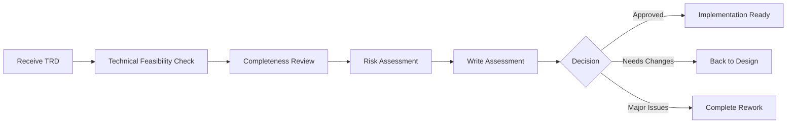

# TRD Review Prompt (v1)

## 🎯 Goal
Critically assess Technical Requirements Document (TRD) for completeness, clarity, technical feasibility, and alignment with business goals.

## 📥 Context (ask if missing)
1. **TRD Document** – location and version of TRD to review
2. **Original Requirements** – source requirements or user stories
3. **Project Constraints** – budget, timeline, technical limitations
4. **Stakeholders** – who will use/approve this TRD

## 🚦 Skip if
- TRD already peer-reviewed and approved **or** simple feature with minimal technical complexity.

## 🔍 Review Checklist

### **Completeness**
- [ ] All functional requirements covered
- [ ] Non-functional requirements specified (performance, security, scalability)
- [ ] API specifications detailed with examples
- [ ] Data models and schemas defined
- [ ] Integration points identified

### **Technical Feasibility**
- [ ] Architecture approach is realistic and scalable
- [ ] Technology choices justified and appropriate
- [ ] Dependencies and third-party services identified
- [ ] Performance requirements achievable
- [ ] Security considerations adequate

### **Clarity & Communication**
- [ ] Technical concepts explained clearly
- [ ] Assumptions explicitly stated
- [ ] Scope boundaries well-defined
- [ ] Success criteria measurable
- [ ] Implementation strategy logical

### **Risk Assessment**
- [ ] Technical risks identified and mitigated
- [ ] Complexity estimation realistic
- [ ] Potential blockers anticipated
- [ ] Fallback options considered

## 📤 Output
**File:** `.agents-playbook/[workflow-name]/trd-review-assessment.md`

Structure:
1. **Executive Summary** – 🟢 Approved / 🟡 Needs Minor Changes / 🔴 Major Revision Required
2. **Strengths** – what's well done
3. **Critical Issues** – must-fix problems
4. **Recommendations** – suggested improvements
5. **Risk Assessment** – potential issues and mitigation
6. **Approval Status** – ready for implementation or needs rework

## 📋 Assessment Template

### Executive Summary
**Status**: [🟢 Approved / 🟡 Minor Changes / 🔴 Major Revision]  
**Confidence Level**: [High/Medium/Low] that implementation will succeed  
**Key Recommendation**: [Main action needed]

### Strengths
- ✅ [What's well documented/designed]
- ✅ [Technical approach strengths]
- ✅ [Clear specifications]

### Critical Issues
| Priority | Section | Issue | Impact | Recommendation |
|----------|---------|-------|--------|----------------|
| High | Architecture | [Issue] | [Business/Technical impact] | [Specific fix] |
| Medium | API Design | [Issue] | [Impact] | [Fix] |

### Technical Assessment

**Architecture Review:**
- Design Pattern: [Appropriate/Concerning/Unclear]
- Scalability: [Well-planned/Adequate/Insufficient]
- Performance: [Optimized/Acceptable/Problematic]

**Implementation Readiness:**
- Development Complexity: [Low/Medium/High]
- Required Skills: [Available/Need Training/Need Hiring]
- Timeline Feasibility: [Realistic/Tight/Unrealistic]

### Risk Analysis
- **High Risk**: [Item] - Probability: [%] - Impact: [High/Medium/Low]
- **Medium Risk**: [Item] - Probability: [%] - Impact: [High/Medium/Low]

### Recommendations
1. **Immediate Actions**: [Must-do before implementation]
2. **Improvements**: [Should-do for better outcomes]
3. **Future Considerations**: [Nice-to-have for next version]

### Approval Decision
- [ ] **Approved**: Ready for implementation
- [ ] **Conditional Approval**: Approved with minor changes
- [ ] **Revision Required**: Major issues must be addressed
- [ ] **Reject**: Fundamental problems, need complete rework

**Next Steps**: [What needs to happen before proceeding]

## ➡️ Review Flow
