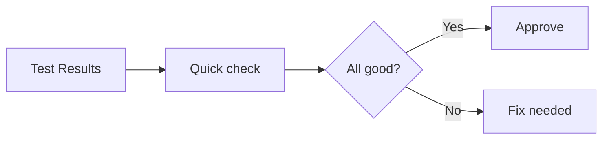

# Update Review Prompt

## 🎯 Goal
Quick final check that updates are safe for production.

## 📥 Context (ask if missing)
1. **Test Results** – did tests pass after updates?
2. **Updated Dependencies** – what was changed

## 🚦 Skip if
- Only patch updates **or** all tests passed cleanly.

## 🔍 Checklist
- [ ] All tests still pass
- [ ] App builds and starts successfully  
- [ ] No new security vulnerabilities: `npm audit`
- [ ] Performance seems normal (no obvious slowdowns)
- [ ] Breaking changes properly handled

## 📤 Output
1. **Status**: ✅ Ready for production or ❌ Needs fixes
2. **Issues found**: Any remaining problems
3. **Recommendation**: Deploy, rollback, or fix first

## ➡️ Response Flow
