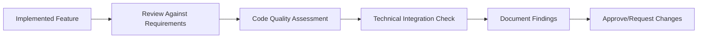

# Implementation Critical Review Prompt (v1)

## 🎯 Goal
Perform comprehensive critical review of implemented feature to verify functionality meets requirements, code quality standards, and architectural guidelines.

## 📋 General Instructions
- **Follow instructions precisely** - review exactly what was implemented, no more, no less
- **Avoid unnecessary changes** - focus on critical issues that impact functionality or maintainability  
- **Be thorough** - examine code, logic, patterns, and integration points carefully
- **Critical assessment** - identify gaps, risks, and improvement opportunities

## 📥 Context (ask if missing)
1. **Implemented Feature** – completed code implementation from implementation phase
2. **Original Requirements** – structured requirements document with acceptance criteria
3. **Design Specifications** – technical architecture and design decisions
4. **Implementation Plan** – tasks breakdown with technical specifications
5. **Code Standards** – existing codebase patterns and conventions

## ❓ Clarifying Questions (ask before proceeding)
**IMPORTANT: Ask clarifying questions directly in chat before proceeding with review.**

Generate concise one-line questions about: implementation completeness, critical functionality gaps, performance concerns, security vulnerabilities, integration issues, code quality standards, error handling coverage, and deployment readiness.


## 🔍 Critical Review Process

### **1. Requirements Compliance Review**
- [ ] **Verify Acceptance Criteria** – check all WHEN/THEN/SHALL requirements are met
- [ ] **Validate User Stories** – ensure implementation supports user goals
- [ ] **Test Edge Cases** – verify handling of boundary conditions and error scenarios
- [ ] **Check Data Flow** – validate data processing and transformations

### **2. Code Quality Assessment**
- [ ] **Architecture Adherence** – follows design specifications and patterns
- [ ] **Code Standards** – consistent with existing codebase conventions
- [ ] **Error Handling** – proper exception handling and user feedback
- [ ] **Performance** – efficient algorithms and resource usage
- [ ] **Security** – proper input validation and authorization

### **3. Integration Validation**
- [ ] **API Contracts** – endpoints match specifications
- [ ] **Database Changes** – schema migrations and data integrity
- [ ] **External Dependencies** – third-party integrations working correctly
- [ ] **Frontend-Backend** – proper data exchange and state management

### **4. Technical Debt Assessment**
- [ ] **Code Duplication** – identify reusable patterns
- [ ] **Maintainability** – code readability and documentation
- [ ] **Scalability** – performance under load and growth scenarios
- [ ] **Dependencies** – appropriate library choices and versions

## 📤 Output
**File:** `.agents-playbook/[feature-name]/review.md`

### Document Structure:
```markdown
# Implementation Critical Review

## Executive Summary
- **Overall Status**: ✅ Ready / ⚠️ Issues Found / ❌ Major Problems
- **Critical Issues**: [Count and severity]
- **Recommendation**: [Proceed/Fix Issues/Major Rework]

## Requirements Compliance
### ✅ Requirements Met
- [List of acceptance criteria successfully implemented]

### ⚠️ Requirements Issues
- **Issue**: [Description]
  - **Impact**: High/Medium/Low
  - **Action Required**: [What needs to be done]

## Code Quality Assessment
### Strengths
- [List of well-implemented aspects]

### Areas for Improvement
- **Issue**: [Description]
  - **Category**: Architecture/Standards/Performance/Security
  - **Priority**: Critical/High/Medium/Low
  - **Recommendation**: [Specific action]

## Integration & Dependencies
- **API Integration**: Status and issues
- **Database Changes**: Validation results
- **External Services**: Connection and error handling
- **Frontend Integration**: Data flow and user experience

## Recommendations
### Must Fix (Critical)
1. [Critical issue that blocks deployment]

### Should Fix (High Priority)  
1. [Important improvement for quality]

### Consider (Medium/Low Priority)
1. [Nice-to-have improvements]

## Sign-off
- **Reviewer**: [Name/Role]
- **Review Date**: [Date]
- **Status**: ✅ Approved / ⚠️ Approved with Conditions / ❌ Rejected
```

## ✅ Quality Checklist
- [ ] **Complete Coverage** – all implemented components reviewed
- [ ] **Requirements Mapping** – every acceptance criteria validated
- [ ] **Code Quality** – standards and patterns verified
- [ ] **Integration Points** – all connections tested
- [ ] **Performance Check** – efficiency and resource usage assessed
- [ ] **Security Review** – vulnerabilities and access controls checked
- [ ] **Documentation** – clear findings and recommendations provided

## 🎯 Focus Areas
- **Functional Correctness** – implementation matches requirements exactly
- **Code Quality** – maintainable, readable, following standards
- **Integration Integrity** – all system connections working properly
- **Performance & Security** – efficient and secure implementation
- **User Experience** – meets usability and accessibility standards
- **Technical Debt** – identifies future maintenance needs

## 🔄 Integration Notes
This prompt works with:
- **requirements.md** - validates against original acceptance criteria
- **design.md** - ensures architectural compliance
- **tasks.md** - checks implementation plan completion
- **Leads to test-cases-planning.md** - provides foundation for test planning

## ➡️ Response Flow


## 💡 Best Practices
- **Be objective** – focus on facts and measurable criteria
- **Provide specifics** – clear examples and actionable feedback
- **Consider impact** – prioritize issues by business and technical impact
- **Think holistically** – review feature in context of overall system
- **Document thoroughly** – create clear record for future reference
